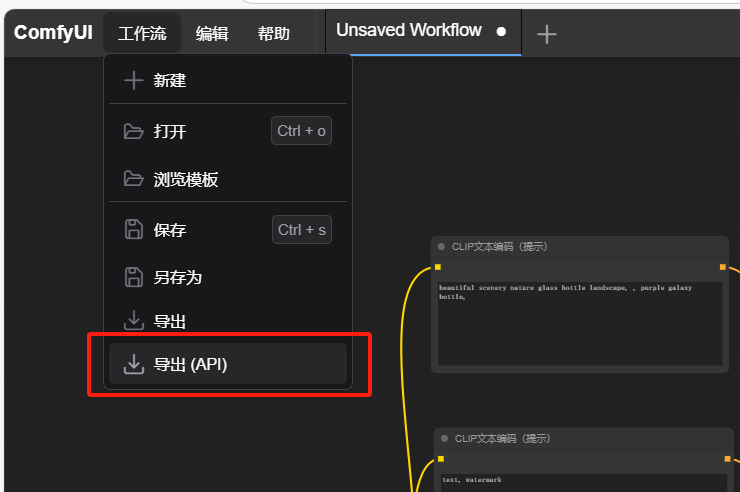

# ComfyUI API Documentation

## ComfyUI API Documentation

### 获取prompt queue\_remaining

**GET** `/api/prompt`

_**返回**_: 提示队列的剩余信息

| 参数               | 类型     | 描述     |
| ---------------- | ------ | ------ |
| queue\_remaining | number | 队列剩余信息 |

_**例子**_:

```json
{
    "exec_info": {
        "queue_remaining": 0
    }
}
```

### 提交prompt

**POST** `/api/prompt`

| 参数          | 类型     | 描述              |
| ----------- | ------ | --------------- |
| client\_id  | string | 客户端ID【必填】       |
| prompt      | object | 提交的prompt对象【必填】 |
| extra\_data | object | 额外的数据           |

_**tips**_: prompt为comfyui页面通过`导出 api`按钮导出的json。

<figure><figcaption></figcaption></figure>

请求示例：

```json
{
    "client_id": "ff4e1f1eb0294c559126fddbfb4df8fa",
    "prompt": {
        "3": {
            "inputs": {
                "seed": 215851134236677,
                "steps": 20,
                "cfg": 8,
                "sampler_name": "euler",
                "scheduler": "normal",
                "denoise": 1,
                "model": [
                    "4",
                    0
                ],
                "positive": [
                    "6",
                    0
                ],
                "negative": [
                    "7",
                    0
                ],
                "latent_image": [
                    "5",
                    0
                ]
            },
            "class_type": "KSampler"
        },
        "4": {
            "inputs": {
                "ckpt_name": "XL\\Dream Tech XL _ 筑梦工业XL_v6.0 - 寄语星河.safetensors"
            },
            "class_type": "CheckpointLoaderSimple"
        },
        "5": {
            "inputs": {
                "width": 512,
                "height": 512,
                "batch_size": 1
            },
            "class_type": "EmptyLatentImage"
        },
        "6": {
            "inputs": {
                "text": "beautiful scenery nature glass bottle landscape, , purple galaxy bottle,",
                "speak_and_recognation": true,
                "clip": [
                    "4",
                    1
                ]
            },
            "class_type": "CLIPTextEncode"
        },
        "7": {
            "inputs": {
                "text": "text, watermark",
                "speak_and_recognation": true,
                "clip": [
                    "4",
                    1
                ]
            },
            "class_type": "CLIPTextEncode"
        },
        "8": {
            "inputs": {
                "samples": [
                    "3",
                    0
                ],
                "vae": [
                    "4",
                    2
                ]
            },
            "class_type": "VAEDecode"
        },
        "9": {
            "inputs": {
                "filename_prefix": "ComfyUI",
                "images": [
                    "8",
                    0
                ]
            },
            "class_type": "SaveImage"
        }
    }
}
```

_返回_: 提交prompt请求的结果

| 参数           | 类型     | 描述            |
| ------------ | ------ | ------------- |
| prompt\_id   | string | 此次prompt生成的id |
| number       | number | 第几个prompt     |
| node\_errors | json   | 错误信息          |

例子：

```json
{
    "prompt_id": "2730a344-0043-4cb3-a73d-0a9c35e81a26",
    "number": 10,
    "node_errors": {}
}
```

### 结果view

**GET** `/view`

| 参数       | 类型     | 描述  |
| -------- | ------ | --- |
| filename | string | 文件名 |

_返回_: 查看结果

例子:

[http://127.0.0.1:8188/view?filename=ComfyUI\_03600\_.png](http://127.0.0.1:8188/view?filename=ComfyUI_03600_.png)

### 历史history list

**GET** `/api/history`

| 参数         | 类型      | 描述    |
| ---------- | ------- | ----- |
| max\_items | integer | 最大项目数 |

_返回_: 历史记录json map

格式如下

```json
{
    "{prompt_id}": {
        "prompt": [],
        "outputs": {},
        "status": {},
        "meta": {}
    }
}
```

### 历史history\_single

**GET** `/api/history/{prompt_id}`

| 参数          | 类型     | 描述     |
| ----------- | ------ | ------ |
| history\_id | string | 历史记录ID |

_返回_: 单个历史记录的详细信息

### 队列queue

**GET** `/api/queue`

_返回_: 队列信息

```json
{
    "queue_running": [],
    "queue_pending": []
}
```

### 获取embeddings

**GET** `/api/embeddings`

_返回_: 嵌入信息

### 获取模块目录models

**GET** `/api/models`

_返回_: 模块目录

```json
[
    "checkpoints",
    "configs",
    "loras",
    "vae",
    "text_encoders",
    "diffusion_models",
    "clip_vision",
    "style_models",
    "embeddings",
    "diffusers",
    ...
]
```

### 获取具体模块目录文件

**GET** `/api/models/{model}`

_返回_: 模块目录配置

例子:`/api/models/checkpoints`

返回

```json
[
    "v1-5-pruned-emaonly.safetensors"
]
```

### 获取扩展文件

**GET** `/api/extensions`

_返回_: 扩展文件

### 上传文件

**POST** `/api/upload/image`

| 参数    | 类型   | 描述       |
| ----- | ---- | -------- |
| image | file | 要上传的图片文件 |

_返回_: 文件上传结果

```json
{
    "name": "image-20240722194828969.png",
    "subfolder": "",
    "type": "input"
}
```

### 上传 mask

**POST** `/api/upload/mask`

| 参数            | 类型     | 描述       |
| ------------- | ------ | -------- |
| image         | file   | 要上传的图片文件 |
| type          | string | 类型       |
| subfolder     | string | 子文件夹     |
| original\_ref | string | 原始引用     |

_返回_: 掩码文件上传结果

```json
{
    "name": "image-20240722194828969.png",
    "subfolder": "clipspace",
    "type": "input"
}
```

### system\_stats

**GET** `/api/system_stats`

_返回_: 系统状态信息

```json
{
    "system": {
        "os": "nt",
        "ram_total": 34187878400,
        "ram_free": 21487468544,
        "comfyui_version": "v0.3.5",
        "python_version": "3.11.6 | packaged by conda-forge | (main, Oct  3 2023, 10:29:11) [MSC v.1935 64 bit (AMD64)]",
        "pytorch_version": "2.4.1+cu124",
        "embedded_python": false,
    },
    "devices": [
        {
            "name": "cuda:0 NVIDIA GeForce RTX 4070 : cudaMallocAsync",
            "type": "cuda",
            "index": 0,
            "vram_total": 12878086144,
            "vram_free": 4595430366,
            "torch_vram_total": 6979321856,
            "torch_vram_free": 6861790
        }
    ]
}
```

### 获取模型 view\_metadata

**GET** `/api/view_metadata/{folder_name}`

| 参数       | 类型     | 描述  |
| -------- | ------ | --- |
| filename | string | 文件名 |

_返回_: 模型元数据

例子: `/api/view_metadata/checkpoints?filename=v1-5-pruned-emaonly.safetensors`

```json
{
    "format": "pt"
}
```

### 所有node object\_info

**GET** `/api/object_info`

_返回_: 所有节点对象信息

### 所有具体node object\_info

**GET** `/api/object_info/{node_type}`

| 参数         | 类型     | 描述   |
| ---------- | ------ | ---- |
| node\_type | string | 节点类型 |

_返回_: 特定节点对象信息

例子:`api/object_info/KSampler` 获取 KSampler 节点的所有信息

### clear或delete queue

**POST** `/api/queue`

| 参数     | 类型      | 描述   |
| ------ | ------- | ---- |
| clear  | boolean | 是否清除 |
| delete | array   | 删除项  |

_返回_: 清除或删除队列项的结果

### clear或delete history

**POST** `/api/history`

| 参数     | 类型      | 描述   |
| ------ | ------- | ---- |
| clear  | boolean | 是否清除 |
| delete | array   | 删除项  |

_返回_: 清除或删除历史记录的结果

### interrupt 中断当前的运行

**POST** `/api/interrupt`

_返回_: 中断当前运行的结果
