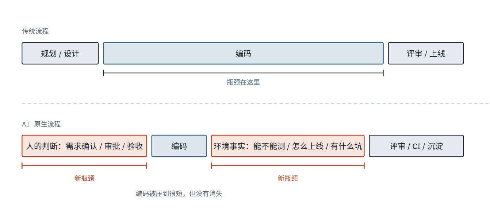
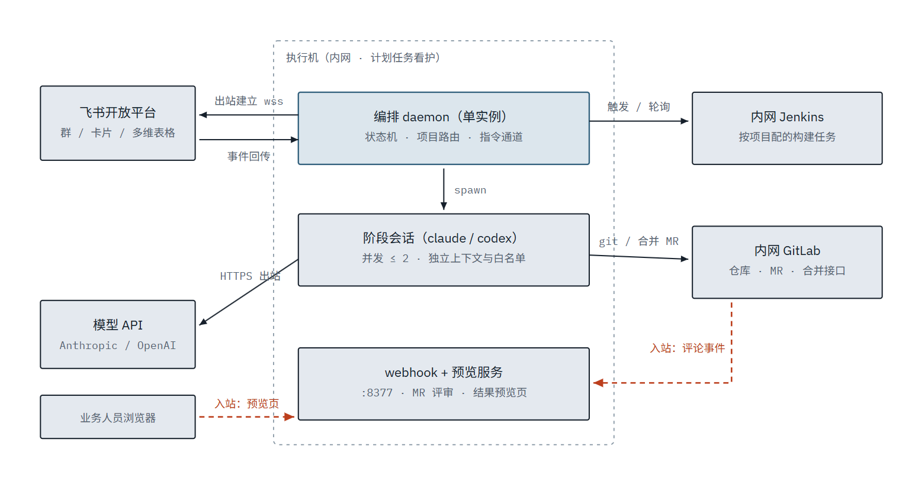
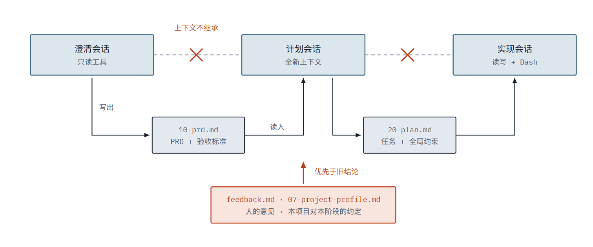
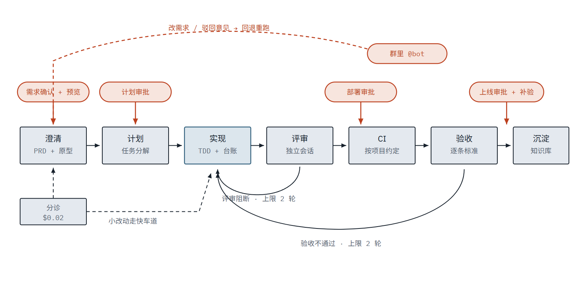

# 搭建自己的Agent Harness环境

三周时间，我把一个飞书群变成了开发流水线的入口：业务需求进来，经澄清、计划、实现、独立评审、CI、验收、上线、知识沉淀走完全程，人只在需要判断的地方出现。

#### 0.前言 代码不再是瓶颈

软件开发生命周期 (SDLC) 是将软件从构思到最终生产的整个过程。大多数组织都会遵循类似的六个阶段，涵盖规划、设计、构建、测试、部署和维护软件。传统上，每个阶段都是一个独立的步骤，由不同的角色负责。产品经理编写需求，技术架构师将需求转化为设计，工程师构建设计，受监管企业的质量保证团队进行验证，发布团队负责发布，运维团队负责监控软件的运行状态。工作在各个阶段之间通过文档、工单和签字确认进行流转。

构建code本身不再是限制因素——限制因素是围绕构建的、以人为单位的步骤。以人为单位的步骤保持其时长，而构建过程则缩短至数小时。

### 1. 代码不再是瓶颈，那瓶颈去哪了

Anthropic 那篇 [AI-Native SDLC Playbook](https://claude.com/blog/the-ai-native-sdlc-playbook) 开篇就是一句判断：代码不再是瓶颈。三周实测下来，我们同意前半句，但要给后半句补一个更具体的答案。

先看一个反直觉的数字。在我实践的过程中，LS-012 是我们最大的一单，20 次会话、$114.78。它的实现阶段一次会话装不下，编排器自动分了 4 批。整个过程里，**写代码从来不是卡住它的东西**——卡住它的是三轮评审里 r3 和 r4 都确认过的一个 Critical 问题，在人工点了重试之后的 r5 被漏检，一路放行到了验收。

这件事告诉我们，当写代码的成本压到接近零之后，瓶颈会转移到两个地方：

1. **人的判断怎么接进流程。** 不是"要不要批准"这种是非题，而是人能不能在正确的时刻、拿着足够的信息、用最省事的方式表达意见。
2. **环境的真相怎么告诉系统。** AI 不知道你的仓库不能全新安装，不知道这个项目没有测试环境，不知道那条 `.gitignore` 会让它写的文档全部不入库。它会按最合理的假设走，然后撞墙。

横向长度表示该环节占用的**真实时间**，不是工作量。这张图是这三周所有设计决策的出发点：我们花在"让人好好表达"和"让系统知道环境真相"上的代码，比花在"让 AI 写代码"上的多得多。

### 把 SDLC 逐环节切开

"把执行交出去"听起来抽象，落到 SDLC 的每个环节上就很具体了。下面这张表是整套系统的骨架：每一行，左边交给智能体，中间那列你必须自己想清楚，右边是 harness 里承载它的东西。

| SDLC 环节   | 执行模型（交给智能体）                              | 决策模型（你必须持有）           | harness 里的载体                  |
| --------- | ---------------------------------------- | --------------------- | ----------------------------- |
| **需求澄清**  | 读代码调查现状、起草 PRD、把歧义整理成带推荐答案的选择题           | 业务口径、范围边界、什么算做完       | 问题卡片 + `10-prd.md` 的验收标准      |
| **设计与计划** | 任务分解、标注每个任务覆盖哪几条验收标准、给出回滚方式              | 方案取舍、风险容忍度、现在要不要做     | 计划审批卡 + `20-plan.md` 的全局约束    |
| **实现**    | TDD 循环、派子代理分工、写进度台账、自查                   | 模型档位怎么分层、分几批止损、哪些文件禁改 | 子代理分层硬约束 + `ledger.md` + 分批上限 |
| **评审**    | 独立会话只读 diff、自己跑测试、按 Spec 与 Quality 两轴给结论 | 什么级别算阻断、既往阻断项怎么处置     | 与状态正交的 `verdict` + 回环上限 2 轮   |
| **CI**    | 触发构建、轮询结果、失败时取日志尾部入工件                    | 哪个项目走哪条流水线、构建失败算不算阻断  | `PIPELINE.md` 的 CI 开关         |
| **验收**    | 自动项亲自跑并记证据、人工项生成零上下文可执行清单                | 逐条判定、能不能实测、无法验证怎么办    | 验收卡 + `testEnv` 开关 + 上线后补验清单  |
| **上线**    | 拉最新目标分支、干跑查冲突、调 API 合并 MR                | 授权与时机、冲突谁来解           | 上线审批卡 + 合并前冲突预检               |
| **沉淀**    | 抽知识条目与术语、写改进建议、增量更新能力地图                  | 哪条该进项目常识、哪条只是偶发       | 三张人审卡（知识 / 术语 / CLAUDE.md）    |

看这张表的中间那列。它们全都**不是技术问题**——没有一条能靠"换个更强的模型"解决。它们是你对自己业务和团队的理解，是你的决策模型的具体条目。

也正是这张表让我们意识到：_这套流水线真正的产物不是代码，而是被逼着写下来的中间那一列。_

***

### 2. 系统长什么样

围绕新的瓶颈我们需要怎么做呢，为此我用3周时间根据自己的开发流程结合我们现有的工具搭建了一套herness。我们公司的使用的环境有claude code/codex、飞书、jenkins、gitlab，所以我基于这个。

箭头方向就是**连接发起方向**。图里只有两条入站连接（虚线），都落在同一个端口——只需在防火墙放行这一个口子。其余连接全部由执行机主动发起，所以不需要公网 IP、域名或内网穿透。这条约束是它能在内网落地的前提。

#### 四层职责

| 层         | 组成                                | 负责什么                                                     |
| --------- | --------------------------------- | -------------------------------------------------------- |
| **交互层**   | 飞书群（主群 + 每项目一个专属群）、互动卡片、群消息指令     | 把人的判断接进流程：选项按钮、打字回答、审批卡点、结果预览页。群与项目绑定后，人不用切上下文。          |
| **编排层**   | 状态机、事件日志、项目流程约定、成本台账              | 决定下一步跑什么：四态路由、回环计数与上限、人工卡点、上线环节、断点恢复。**不写业务代码。**         |
| **执行层**   | 8 个阶段 skill，由 headless 会话调起       | 真正干活：读代码、写 PRD、出原型、出计划、改代码跑测试、独立评审、验收、沉淀。每阶段独立上下文与工具白名单。 |
| **基础设施层** | 内网 GitLab、Jenkins、目标仓库、飞书多维表格与知识库 | 代码托管、构建部署、看板与知识沉淀、交付文档归档。流水线以 REST 接入，不改动它们的既有工作方式。      |

> **分层的意义**
>
> 编排层永远不碰业务代码，执行层永远不做流程决策。这条边界让状态机可以是纯函数——因此可测试、可预测；也让任何一个阶段能被单独调起调试，真机排查问题时不必启动整条流水线。

***

### 3. 契约：AI 和编排器之间只有一张纸

编排器怎么知道一个阶段跑完了、跑成什么样、下一步该干什么？答案是一份结构化返回，四种状态覆盖全部路由分支。这张纸是整个系统最重要的设计。

| 状态                   | 含义           | 编排器动作                  |
| -------------------- | ------------ | ---------------------- |
| `DONE`               | 完成，产物可被下游消费  | 推进下一阶段                 |
| `DONE_WITH_CONCERNS` | 完成但有不阻断的疑虑   | 推进，疑虑附到下一个人工卡点上        |
| `NEEDS_CONTEXT`      | 缺信息，无法负责任地完成 | 渲染问题卡片，收齐答案后**重跑同一阶段** |
| `BLOCKED`            | 信息齐全但存在矛盾或障碍 | 挂起转人工，附原因与工件链接         |

***

### 4. 交接：不续会话，写文件

每个阶段都是一次全新会话，上下文不继承。阶段之间传递的是**提交进 git 的交接文档**：结论、关键决策及理由、事实与假设的分区、失败过的尝试、给下一阶段的指令。

***

### 5. 一张工单怎么走完，以及怎么退回来

当执行的边际成本趋近于零，工程师的核心资产就只剩下**决策模型**——什么算做对了、什么可以妥协、什么时候必须停下来。_把执行模型交给智能体，把决策模型建起来并握在自己手里_；而 harness 就是把这两个模型接在一起的那层东西。这套流水线是这个理念的一次完整实践。

### 6.总结

三周下来，三条结论。

**第一，"代码不再是瓶颈"是真的，但它换来的不是"更快交付"，而是"更多需要人判断的时刻"。** 一张工单从建单到上线，人出现 6 次；如果这 6 次里有任何一次让人拿不到足够信息、或者表达不方便，整条流水线就停在那里。我们花在交互层的代码不比编排层少。

**第二，最重要的产物不是代码，是那份写在仓库里的项目约定和沉淀下来的知识。** 代码这一单交付完就归档了，而"这个仓库不能全新安装""这个项目没有测试环境""改共享函数要核全部调用入口"这些事实，会让下一张工单便宜一大截。首单贵是一次性的，前提是你真的把学费记下来。

**第三，让系统对自己诚实，比让它显得聪明重要得多。** 成本没配价目表就记 0 并注明"未计价"，而不是猜一个数；能力地图落后多少提交要写在注入头里，而不是假装是新的；验收人工项在没有测试环境时记"无法验证"，而不是冒充通过。每一次我们在这上面偷懒，代价都会在几天后以更贵的方式回来。

***

如果这篇只能留下一句：**别再把精力全花在"怎么让 AI 写得更好"上，先回答"我判断一件事做对了的标准是什么"。**&#x524D;者是执行模型，它正在快速变便宜、变得与你无关；后者是决策模型，它是你在这个时代真正的资产。而 harness——不管是我们这套流水线，还是你自己的一个脚本加一份 checklist——就是把后者变成前者必须遵守的约束的那层东西。

### 7.参考

[https://claude.com/blog/the-ai-native-sdlc-playbook](https://claude.com/blog/the-ai-native-sdlc-playbook)

[https://github.com/obra/superpowers](https://github.com/obra/superpowers)

[https://github.com/mattpocock/skills](https://github.com/mattpocock/skills)

[https://multica.ai/docs/zh/tasks](https://multica.ai/docs/zh/tasks)

**仓库地址**

[https://github.com/AndsGo/pipeline-orchestrator](https://github.com/AndsGo/pipeline-orchestrator)

[https://github.com/AndsGo/pipeline-plugin](https://github.com/AndsGo/pipeline-plugin)
