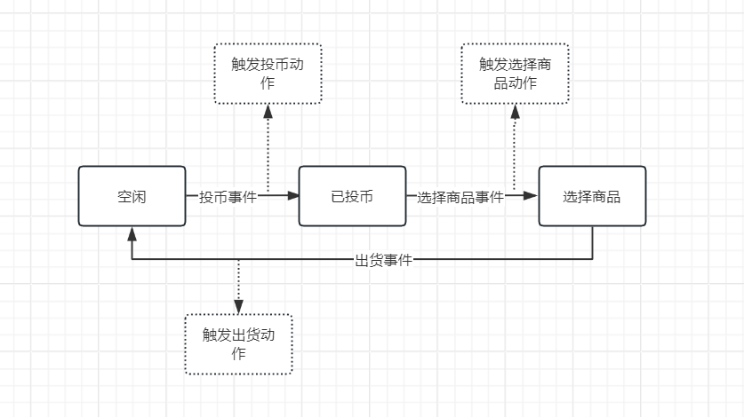

# Go有限状态机实现和实战


<figure><figcaption><p>FSM</p></figcaption></figure>

### 有限状态机

> 什么是状态机

有限状态机（Finite State Machine, FSM）是一种用于建模系统行为的计算模型，它包含有限数量的状态，并通过事件或条件实现状态之间的转换。FSM的状态数量是有限的，因此称为**有限状态机**

关于有限的解释：也就是被描述的事物的状态的数量是有限的，例如开关的状态只有“开”和“关”两个;灯的状态只有“亮”和“灭”等等。

> 特点

状态机的状态数量是有限的,在确定的状态下，给定特定的事件，系统会转换到明确的下一个状态。

> 作用

使用状态机来表达状态的流转，会使语义会更加清晰，会增强代码的**稳定性**、**可控性**和**可维护性**。

> 适用场景

面对复杂的状态流转都可以使用状态机来实现

状态机是描述系统行为的强大工具，其核心是状态、事件和状态转换。它的清晰逻辑和确定性使其在复杂流程控制、嵌入式设备、游戏开发等领域非常适用，为系统开发提供了简洁、高效的解决方案。

### 状态机核心概念

状态机有四个核心概念，这是所有状态机的基础

* **State**：状态。一个状态机至少要包含两个状态。
* **Transition**：过渡。也就是从一个状态变化为另一个状态（即**状态转移**）。
* **Event**：事件。事件会触发状态转移，也就是状态转移的**条件**。
* **Action**：动作。事件发生以后要执行动作，即**事件处理**。

有限状态机的工作原理如图所示，发生事件(event)后，根据当前状态(cur\_state) ，决定执行的动作(action)，并设置下一个状态(next\_state)。

### Go状态机设计

我们根据上面的概念设计一个状态机

#### 示例：自动贩卖机状态机

<figure><figcaption></figcaption></figure>

```go
package main
​
import (
    "fmt"
)
​
// 定义状态类型
type State string
//  1.State：状态。一个状态机至少要包含两个状态。
const (
    StateIdle     State = "Idle(空闲)"     // 空闲状态
    StateCoin     State = "Coin(投币)"     // 投币状态
    StateItem     State = "Item(选择商品)"     // 选择商品状态
)
​
// 定义事件类型
type Event string
// 2.Event：事件。事件会触发状态转移，也就是状态转移的条件。
const (
    EventInsertCoin  Event = "InsertCoin"  // 投币事件
    EventSelectItem  Event = "SelectItem"  // 选择商品事件
    EventDispense    Event = "Dispense"    // 出货事件
)
​
// 定义状态转移 
// 3.Transition：过渡。也就是从一个状态变化为另一个状态（即状态转移）。
const(
    Transitions = map[State]map[Event]State{
            StateIdle: {
                EventInsertCoin: StateCoin,
            },
            StateCoin: {
                EventSelectItem: StateItem,
            },
            StateItem: {
                EventDispense: StateIdle,
            },
    }
)
​
​
// 定义状态机结构体
type FSM struct {
    currentState State
    transitions  map[State]map[Event]State // 状态-事件转换映射
}
// 创建状态机
func NewFSM() *FSM {
    return &FSM{
        currentState: StateIdle, // 初始状态
        transitions: Transitions,
    }
}
​
// 处理事件并进行状态转换
// 4.Action：动作。事件发生以后要执行动作，即事件处理。
func (fsm *FSM) HandleEvent(event Event) {
    nextState, ok := fsm.transitions[fsm.currentState][event]
    if !ok {
        fmt.Printf("事件 %s 无法从状态 %s 转换\n", event, fsm.currentState)
        return
    }
    fmt.Printf("从状态 %s 转到状态 %s 通过事件 %s\n", fsm.currentState, nextState, event)
    fsm.currentState = nextState
}
​
// 获取当前状态
func (fsm *FSM) CurrentState() State {
    return fsm.currentState
}
​
func main() {
    fsm := NewFSM()
​
    // 测试状态机
    fsm.HandleEvent(EventInsertCoin)  // 投币，进入选择商品状态
    fsm.HandleEvent(EventSelectItem)  // 选择商品，准备出货
    fsm.HandleEvent(EventDispense)    // 出货，返回初始状态
}
​
```

运行结果

```
从状态 Idle(空闲) 转到状态 Coin(投币) 通过事件 InsertCoin(投币事件)
从状态 Coin(投币) 转到状态 Item(选择商品) 通过事件 SelectItem(选择商品事件)
从状态 Item(选择商品) 转到状态 Idle(空闲) 通过事件 Dispense(出货事件)
```

代码解释:

* State(对&#x5E94;_**State**_) ：定义了有限状态机的状态和事件。状态有 Idle、Coin、Item 和 Dispense。
* Event(对&#x5E94;_**Event**_)：事件有 InsertCoin、SelectItem、Dispense 和 ReturnCoins。
* Transitions(对&#x5E94;_**Transition**_)：定义了状态转移规则，即当某个状态收到某个事件时，会转移到另一个状态。
* HandleEvent(对&#x5E94;_**Action**_)：该方法处理事件，并根据当前状态和事件查找下一个状态。如果找不到对应的转换，则表示事件在当前状态下无效。
* FSM 结构体：负责存在状态机的信息，FSM 包含当前状态和状态转换规则。transitions 映射定义了每个状态在不同事件下的下一个状态。

### 事件处理

我们可以&#x5C06;_&#x41;ctio&#x6E;_&#x8FDB;行拓展，对状态机进行扩展，比如添加日志记录、超时处理、错误处理、通知等。

<figure><figcaption></figcaption></figure>

具体实现我们可以参考下面生产使用的代码。

### 生产使用

上面的代码是一个简单的状态机，实际使用中，需要考虑更多的因素，比如状态的初始化、状态的持久化、状态的恢复、状态的监听等。

1. 状态的初始化：在创建状态机时，需要初始化当前状态，并设置初始状态的转换规则。
2. 状态的持久化：在状态机中，需要将状态的转换记录持久化到数据库或者文件中，以便在系统重启时恢复状态。
3. 状态的恢复：在系统重启时，需要根据持久化的状态记录恢复状态机。
4. 状态的监听：在状态机中，需要监听状态的变化，以便在状态发生变化时进行通知。
5. 状态的校验：在状态机中，需要校验状态的转换是否合法，比如不允许从空闲状态直接进入选择商品状态。
6. 状态的错误处理：在状态机中，需要处理状态转换过程中出现的错误，比如转换失败、超时等。
7.  状态的日志记录：在状态机中，需要记录状态的转换记录，以便后续分析

    ...

生产上我们可以使用 [github.com/looplab/fsm](https://github.com/looplab/fsm) 这个库提供了一些常用的功能，如状态的初始化、状态的持久化、状态的恢复、状态的监听等。

```go
package fsm_demo
​
import (
    "context"
    "fmt"
    "testing"
​
    "github.com/looplab/fsm"
)
​
// 定义状态类型
type State string
​
// 1.State：状态。一个状态机至少要包含两个状态。
const (
    StateIdle State = "Idle(空闲)"   // 空闲状态
    StateCoin State = "Coin(投币)"   // 投币状态
    StateItem State = "Item(选择商品)" // 选择商品状态
)
​
// 定义事件类型
type Event string
​
// 2. Event：事件。事件会触发状态转移，也就是状态转移的条件。
const (
    EventInsertCoin Event = "InsertCoin" // 投币事件
    EventSelectItem Event = "SelectItem" // 选择商品事件
    EventDispense   Event = "Dispense"   // 出货事件
)
​
type FSM struct {
    Id  string   // 数据id
    FSM *fsm.FSM // 状态机
}
​
func NewFSM(id string) *FSM {
    d := &FSM{
        Id: id,
    }
​
    d.FSM = fsm.NewFSM(
        string(StateIdle),
        // 3. Transition 定义转换
        fsm.Events{
            {Name: string(EventInsertCoin), Src: []string{string(StateIdle)}, Dst: string(StateCoin)},
            {Name: string(EventSelectItem), Src: []string{string(StateCoin)}, Dst: string(StateItem)},
            {Name: string(EventDispense), Src: []string{string(StateItem)}, Dst: string(StateIdle)},
        },
        // 4. Action 定义动作
        fsm.Callbacks{
            "before_event": func(ctx context.Context, e *fsm.Event) {
                fmt.Println(e.Args[0])
                e.FSM.SetMetadata("error", "error")
                fmt.Println("before_event 通用（可以记录日志）", e.Event, e.FSM.Current())
                e.Err = fmt.Errorf("error")
                e.Cancel()
                // e.Event = "error"
            },
            fmt.Sprintf("before_%s", EventInsertCoin): func(ctx context.Context, e *fsm.Event) {
                fmt.Println("before", EventInsertCoin, e.Event, e.FSM.Current())
                // e.Err = fmt.Errorf("error")
            },
            fmt.Sprintf("enter_%s", StateCoin): func(ctx context.Context, e *fsm.Event) {
                fmt.Println("enter", StateCoin, e.Event, e.FSM.Current())
                // e.Err = fmt.Errorf("error")
            },
            "enter_state": func(_ context.Context, e *fsm.Event) { d.enterState(e) },
            fmt.Sprintf("after_%s", EventInsertCoin): func(ctx context.Context, e *fsm.Event) {
                fmt.Println("after", EventInsertCoin, e.Event, e.FSM.Current())
                // e.Err = fmt.Errorf("error")
            },
            "after_event": func(_ context.Context, e *fsm.Event) {
                fmt.Println(e.FSM.Metadata("error"))
                fmt.Println("after_event 通用(可以记录日志)", e.Event, e.FSM.Current())
            },
        },
    )
    return d
}
​
// 更新状态
func (d *FSM) enterState(e *fsm.Event) {
    // called after entering all states
    // todo 更新数据库,持久化
    fmt.Println("enter_state 通用 更新数据库", e.FSM.Current())
}
​
func Test_Main(t *testing.T) {
    plan := NewFSM(string(StateIdle))
​
    err := plan.FSM.Event(context.Background(), string(EventInsertCoin), 1)
    if err != nil {
        fmt.Println(err)
    }
    fmt.Println(plan.FSM.Current())
    err = plan.FSM.Event(context.Background(), string(EventSelectItem))
    if err != nil {
        fmt.Println(err)
    }
    fmt.Println(plan.FSM.Current())
    err = plan.FSM.Event(context.Background(), string(EventDispense))
    if err != nil {
        fmt.Println(err)
    }
    fmt.Println(plan.FSM.Current())
    err = plan.FSM.Event(context.Background(), string(EventDispense))
    if err != nil {
        fmt.Println(err)
    }
    fmt.Println(plan.FSM.Current())
}
​
```

使用去起来和我们自己写的代码类型，也是定义 State ,Evnent,Transition,Action。这个是所有FSM通用的

这个库可以很灵活的配置事件处理。可以配置很多前置和后置事件。

```
// 1. before_<EVENT> - 在名为 <EVENT> 的事件之前调用
// 2. before_event - 在所有事件之前调用
// 3. leave_<OLD_STATE> - 在离开 <OLD_STATE> 之前调用
// 4. leave_state - 在离开所有状态之前调用
// 5. enter_<NEW_STATE> - 在进入 <NEW_STATE> 之后调用
// 6. enter_state - 在进入所有状态之后调用
// 7. after_<EVENT> - 在名为 <EVENT> 的事件之后调用
// 8. after_event - 在所有事件之后调用
```

而且错误处理机制也很完善。使用这个库后大家可以把更多的精力关注业务层。

参考:

[https://github.com/looplab/fsm](https://github.com/looplab/fsm)

[https://www.cnblogs.com/huageyiyangdewo/p/17351310.html](https://www.cnblogs.com/huageyiyangdewo/p/17351310.html)
