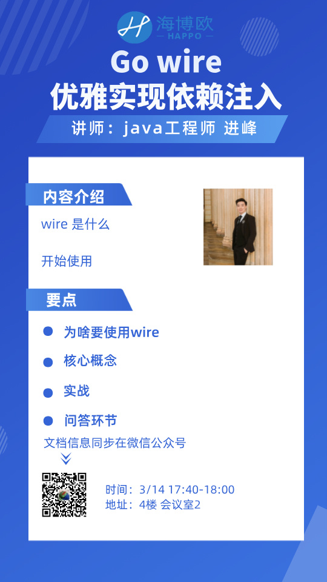

# 🔃 Go 语言中的依赖注入：由浅入深Wire 框架


<figure><figcaption></figcaption></figure>

本期我们分享人是组内小伙伴进峰，给大家分享下 Go 语言中的依赖注入。

### **一、前言**

在现代软件开发中，线上项目往往依赖大量的资源，如数据库、消息队列、各种中间件等。随着项目业务的复杂化，单一项目内的业务模块也逐渐增多，如何高效、整洁地管理这些资源成为了一个重要的课题。

本文将从“术”的层面，深入探讨依赖注入（Dependency Injection, DI）的实现方式，并展示其在整洁架构（Clean Architecture）和领域驱动设计（DDD）等设计思想中的实际应用。

#### 涉及内容：

1. **Google Wire**：GitHub 13.5k Star 的 Go 语言依赖注入库 [Wire](https://github.com/google/wire)
2. **Kratos**：GitHub 23.9k Star 的 Go 微服务框架，默认使用 Wire 作为依赖注入工具 [Kratos](https://github.com/go-kratos/kratos)
3. **其他运行时依赖注入框架与wire(编译时依赖注入框架)的对比**

***

### 二、为什么使用依赖注入？

依赖注入（DI）是一种代码构造模式，它能够让你的代码更加易于维护和测试。

#### 1. 案例分析：依赖注入的必要性

**不使用依赖注入的风险：**

* **全局变量的不安全性**：全局变量容易被意外修改，存在覆写的风险。
* **资源管理混乱**：资源散落在各处，可能导致重复创建，浪费内存，维护困难。
* **循环依赖风险**：手动管理依赖关系时，容易引入循环依赖问题。

**示例代码：**

*   **不使用依赖注入**：

    ```
    package main
    ​
    var (
        mysqlUrl = "mysql://blabla"
        db = NewMySQLClient(mysqlUrl)  // 全局数据库实例
    )
    ​
    func NewMySQLClient(url string) *MySQLClient {
        return &MySQLClient{url: url}
    }
    ​
    type MySQLClient struct {
        url string
    }
    ​
    func (c *MySQLClient) Exec(query string, args ...interface{}) string {
        return "data"
    }
    ​
    func NewApp() *App {
        return &App{}
    }
    ​
    type App struct {}
    ​
    func (a *App) GetData(query string, args ...interface{}) string {
        data := db.Exec(query, args...)
        return data
    }
    ​
    func main() {
        app := NewApp()
        rest := app.GetData("select * from table where id = ?", "1")
        println(rest)
    }
    ```
*   **手动依赖注入**：

    ```
    package main
    ​
    func NewMySQLClient(url string) *MySQLClient {
        return &MySQLClient{url: url}
    }
    ​
    type MySQLClient struct {
        url string
    }
    ​
    func (c *MySQLClient) Exec(query string, args ...interface{}) string {
        return "data"
    }
    ​
    func NewApp(client *MySQLClient) *App {
        return &App{client: client}
    }
    ​
    type App struct {
        client *MySQLClient  // App 持有唯一的 MySQLClient 实例
    }
    ​
    func (a *App) GetData(query string, args ...interface{}) string {
        data := a.client.Exec(query, args...)
        return data
    }
    ​
    func main() {
        client := NewMySQLClient("mysql://blabla")
        app := NewApp(client)
        rest := app.GetData("select * from table where id = ?", "1")
        println(rest)
    }
    ```

#### 2. 总结：不使用依赖注入 vs 手动依赖注入

**不使用依赖注入：**

* **优点**：代码简单，直接使用全局变量或单例模式，适合小型项目或快速原型开发。
* **缺点**：
  * **全局变量的不安全性**：全局变量容易被意外修改，导致不可预见的错误。
  * **资源管理混乱**：资源散落在各处，可能导致重复创建，浪费内存，维护困难。
  * **循环依赖风险**：手动管理依赖关系时，容易引入循环依赖问题。
  * **测试困难**：由于依赖关系硬编码在代码中，单元测试时难以替换依赖项。

**手动依赖注入：**

* **优点**：
  * **解耦依赖**：通过构造函数或方法参数显式传递依赖，降低了模块之间的耦合度。
  * **提高可测试性**：依赖项可以通过参数传递，便于在测试中使用模拟对象（Mock）。
  * **资源管理清晰**：依赖关系明确，资源创建和销毁更加可控。
* **缺点**：
  * **代码复杂度增加**：随着依赖项增多，手动管理依赖关系会变得繁琐。
  * **维护成本高**：在大型项目中，手动管理依赖关系容易出错，且难以追踪依赖链。

**依赖注入框架（如 Wire）的优势：**

* **自动化依赖管理**：通过代码生成工具自动管理依赖关系，减少手动编写依赖注入代码的工作量。
* **编译时检查**：依赖注入问题在编译时即可发现，避免了运行时错误。
* **代码可读性**：生成的代码符合常规编程习惯，易于理解和调试。

***

### 三、为什么使用Wire实现依赖注入？

Wire 是 Google 开源的依赖注入框架。官方定义是：“Wire 是一个代码生成工具，它使用依赖注入自动连接组件。” 简而言之，Wire 通过生成代码的方式，帮助开发者自动管理组件之间的依赖关系。

除了 Wire，Go 语言中还有其他依赖注入框架，如 Uber 的 [dig](https://github.com/uber-go/dig) 和 Facebook 的 [inject](https://github.com/facebookarchive/inject)。这些框架大多使用反射机制实现运行时依赖注入，而 Wire 则通过代码生成的方式实现编译时依赖注入。

#### Wire 的优势：

* **编译时依赖注入**：Wire 在编译时生成依赖注入代码，避免了运行时反射带来的性能损失。
* **代码可读性**：生成的代码符合常规编程习惯，易于理解和调试。
* **错误提前暴露**：依赖注入问题在编译时即可发现，避免了运行时错误。

***

### 四、如何使用 Wire？

#### 4.1 基本使用

**安装 Wire：**

```
go install github.com/google/wire/cmd/wire@latest
```

**Provider 与 Injector：**

*   **Provider**：普通的 Go 函数，用于生成某个对象。Wire 通过 Provider 了解对象的依赖关系。

    ```
    func NewMySQLClient(url string) *MySQLClient {
        return &MySQLClient{url: url}
    }
    ​
    func NewApp(client *MySQLClient) *App {
        return &App{client: client}
    }
    ```
*   **Injector**：Wire 生成的函数，用于按依赖顺序调用 Provider。

    ```
    // wire.go
    //go:build wireinject
    // +build wireinject
    ​
    package main
    ​
    import "github.com/google/wire"
    ​
    func wireApp(url string) *App {
        wire.Build(NewMySQLClient, NewApp)
        return nil
    }
    ```

    执行 `wire` 命令后，生成 `wire_gen.go` 文件：

    ```
    // wire_gen.go
    func wireApp(url string) *App {
        mySQLClient := NewMySQLClient(url)
        app := NewApp(mySQLClient)
        return app
    }
    ```

#### 4.2 复杂项目的依赖注入设计

以 Kratos 的模板项目为例，展示如何在复杂项目中使用 Wire 进行依赖注入。

**项目结构：**

```
├── biz
├── conf
├── data
├── server
└── service
```


**依赖关系：**

* **data**：业务数据访问层，包含数据库、缓存等封装。
* **biz**：业务逻辑层，类似 DDD 的 domain 层。
* **service**：服务层，处理 DTO 到 DO 的转换。
* **server**：HTTP 和 gRPC 服务的创建与配置。

**Provider 定义：**

```
// biz 目录
var ProviderSet = wire.NewSet(NewGreeterUsecase)
​
type GreeterUsecase struct {
    repo GreeterRepo
    log  *log.Helper
}
​
func NewGreeterUsecase(repo GreeterRepo, logger log.Logger) *GreeterUsecase {
    return &GreeterUsecase{repo: repo, log: log.NewHelper(logger)}
}
```

**Injector 定义：**

```
// wire.go
func wireApp(*conf.Server, *conf.Data, log.Logger) (*kratos.App, func(), error) {
    panic(wire.Build(server.ProviderSet, data.ProviderSet, biz.ProviderSet, service.ProviderSet))
}
```

**生成代码：**

运行`wire`命令生成依赖注入代码

```
wire
```

```
// wire_gen.go
func wireApp(confServer *conf.Server, confData *conf.Data, logger log.Logger) (*kratos.App, func(), error) {
    dataData, cleanup, err := data.NewData(confData, logger)
    if err != nil {
        return nil, nil, err
    }
    greeterRepo := data.NewGreeterRepo(dataData, logger)
    greeterUsecase := biz.NewGreeterUsecase(greeterRepo, logger)
    greeterService := service.NewGreeterService(greeterUsecase)
    grpcServer := server.NewGRPCServer(confServer, greeterService, logger)
    httpServer := server.NewHTTPServer(confServer, greeterService, logger)
    app := newApp(logger, grpcServer, httpServer)
    return app, func() {
        cleanup()
    }, nil
}
```

#### 4.3 Wire 的高级用法

*   **携带错误返回值的 Provider**：

    ```
    func ProvideBaz(ctx context.Context, bar Bar) (Baz, error) {
        if bar.X == 0 {
            return Baz{}, errors.New("cannot provide baz when bar is zero")
        }
        return Baz{X: bar.X}, nil
    }
    ```
*   **Provider 集合**：

    ```
    var SuperSet = wire.NewSet(ProvideFoo, ProvideBar, ProvideBaz)
    ```

***

### 五、（dig、inject、springboot）运行时依赖注入框架 与 Wire 的依赖注入对比

#### 相同点：

1. **降低耦合度**：两者都通过依赖注入实现代码的松耦合。
2. **提高可测试性**：依赖注入使得单元测试更加容易。
3. **灵活性**：在不修改组件代码的情况下替换依赖项。

#### 不同点：

1. **实现方式**：
   * 运行时依赖注入 依赖运行时反射机制。
   * Wire 依赖编译时代码生成。
2. **配置方式**：
   * 运行时依赖注入 使用配置文件和注解。
   * Wire 使用 Go 文件和代码生成指令。
3. **运行时开销**：
   * 运行时依赖注入依赖反射运行，存在运行时开销。
   * Wire 在编译时生成代码，运行时无额外开销。

***

### 六、参考资料

* [Kratos 文档](https://go-kratos.dev/en/docs/getting-started/start/)
* [Wire 官方教程](https://github.com/google/wire/blob/main/_tutorial/README.md)

***

通过本文，你应该对 Go 语言中的依赖注入有了更深入的理解，并能够使用 Wire 框架来管理项目中的依赖关系。无论是小型项目还是复杂的微服务架构，Wire 都能帮助你构建更加整洁、可维护的代码、同时显著减少程序员的心智和体力负担。
