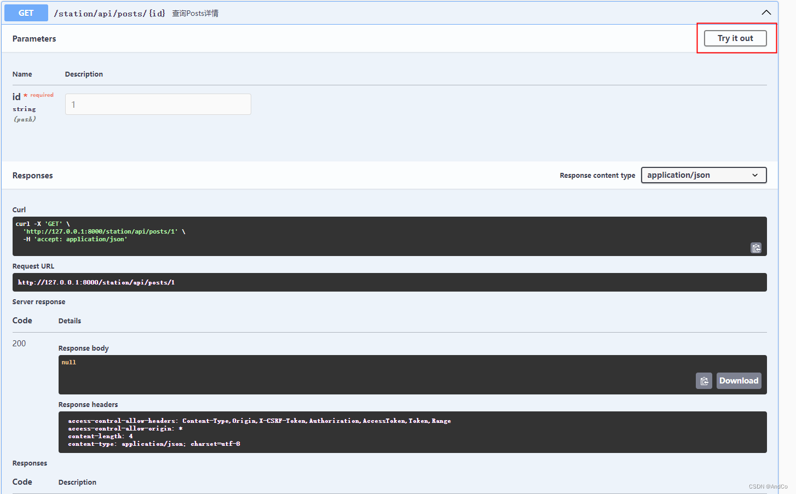

# oss图片处理库

<figure><figcaption></figcaption></figure>

### 0.概述

在web开发中我们页面需要对图片做各种处理,如`图片缩放`、`自定义裁剪`、`质量变换`、`格式转换`等。

而且长期以来，加载速度一直是优化网站最重要的因素之一，访问者和搜索引擎都将调用页面所需的时间作为重要的评价标准。精简的代码或使用缓存机制是解决网站快速加载方案的一部分，而网页中展示的图片大小也影响着加载速度。因此我们不能仅仅通过前端处理，而是在返回图片的时间就要减少大小。

如果是国内用户使用阿里云oss，里面的图片处理使用起来就很方便。但是你如果使用s3或自己搭建得文件服务系统的话，你就得自己实现了。以往我们对于这种得话，我们需要提取准备很多规格得图片上传到文件系统，然后再不同场景使用，但是使用场景会随时变化。那电商来说上传到不同平台得图片尺寸要求不尽相同，这是就得准备大量不同规格得图片了。

因此我们可以自己设计一个类似oss图片处理系统，让以前不支持图片处理得文件系统拥有**动态处理图片**得能力。

[imageprocess](https://github.com/AndsGo/imageprocess)库可以帮助我们非常简单实现。

`Imageprocess`是一个简单的Go图像处理包。支持 WEBP,JPG,JPEG,PNG,BMP,TIFF,GIF。提供了类似阿里云`oss`的图片处理能力。 包括:

[图片缩放](https://github.com/AndsGo/imageprocess/blob/main/doc/resize.md)

[图片水印](https://github.com/AndsGo/imageprocess/blob/main/doc/watermark.md)

[自定义裁剪](https://github.com/AndsGo/imageprocess/blob/main/doc/crop.md)

[质量变换](https://github.com/AndsGo/imageprocess/blob/main/doc/quality.md)

[格式转换](https://github.com/AndsGo/imageprocess/blob/main/doc/format.md)

[模糊效果](https://github.com/AndsGo/imageprocess/blob/main/doc/blur.md)

[旋转](https://github.com/AndsGo/imageprocess/blob/main/doc/rotate.md)

[亮度](https://github.com/AndsGo/imageprocess/blob/main/doc/bright.md)

[锐化](https://github.com/AndsGo/imageprocess/blob/main/doc/sharpen.md)

[对比度](https://github.com/AndsGo/imageprocess/blob/main/doc/sharpen.md)

参数兼容阿里云oss图片处理参数，可以用于搭建本地文件oss图片处理系统。

### 1.安装

```
go get github.com/AndsGo/imageprocess
```

### 2.api调用

```
import (
    "image/color"
    "os"
    "testing"
    "github.com/AndsGo/imageprocess"
)
​
func Test_Process(t *testing.T) {
    img, f, err := imageprocess.LoadImage("examples/example.jpg")
    if err != nil {
        t.Error(err)
    }
    file, _ := os.Create("examples/out.jpg")
    options := make([]Option, 0)
    // 格式转换为PNG
    options = append(options, Option{FormatType, FormatOption{Format: PNG}})
    //  改变大小
    options = append(options, Option{Resize, ResizeOption{ResizeMode: Pad, Width: 300, Height: 300, Color: &color.RGBA{R: 255, G: 255, B: 0, A: 255}}})
    // 裁剪
    options = append(options, Option{Crop, CropOption{Width: 200, Height: 200, X: 0, Y: 0, Position: Center}})
    // 水印
    options = append(options, Option{Watermark, TextWatermarkOption{WatermarkOption: WatermarkOption{
        Opacity: 100, Position: South, X: 10, Y: 10,
    }, Color: &color.RGBA{111, 222, 111, 1}, Size: 40, Text: "hello watermark"}})
    // 模糊
    options = append(options, Option{Blur, GammaOption{Value: 5}})
    // 质量
    options = append(options, Option{Quality, QualityOption{Quality: 500}})
    err = imageprocess.Process(img, file, f, options)
    if err != nil {
        t.Error(err)
    }
}
​
func Test_ProcessGif(t *testing.T) {
    img, err := imageprocess.LoadGif("examples/example.gif")
    if err != nil {
        t.Error(err)
    }
    file, _ := os.Create("examples/out.gif")
    options := make([]Option, 0)
    // 格式转换为GIF
    options = append(options, Option{FormatType, FormatOption{Format: GIF}})
    options = append(options, Option{Gamma, GammaOption{Value: 500}})
    options = append(options, Option{Resize, ResizeOption{ResizeMode: Pad, Width: 300, Height: 300, Color: &color.RGBA{R: 255, G: 255, B: 255, A: 1}}})
    options = append(options, Option{Crop, CropOption{Width: 200, Height: 200, X: 0, Y: 0, Position: Center}})
    options = append(options, Option{Watermark, TextWatermarkOption{WatermarkOption: WatermarkOption{
        Opacity: 20, Position: Center, X: 10, Y: 10,
    }, Color: &color.RGBA{0, 0, 0, 1}, Size: 40, Text: "hello watermark"}})
    err = imageprocess.ProcessGif(img, file, options)
    if err != nil {
        t.Error(err)
    }
}
​
func Test_UrlOptions(t *testing.T) {
    img, f, err := imageprocess.LoadImage("examples/example.jpg")
    if err != nil {
        t.Error(err)
    }
    file, _ := os.Create("examples/out.jpg")
    // 增加水印，然后修改大小
    options, err := imageprocess.ParseOptions("image/watermark,t_30,g_center,x_10,y_10,text_hello watermark,color_1366ec,size_200/resize,m_pad,h_100,w_100,color_FF0000")
    if err != nil {
        t.Error(err)
    }
    err = imageprocess.Process(img, file, f, options)
    if err != nil {
        t.Error(err)
    }
​
}
```

更多api查看 [doc](https://pkg.go.dev/github.com/AndsGo/imageprocess)

### 3.Url参数调用

在源码 examples 目录里面实现了一个简单得文件服务器。我们可以轻松实现图片得动态处理。

```
cd examples
go run example.go
```

我们可以启动后进行测试。下面我们进行测试

原图：


我们可以和阿里oss一样进行调用了，参数放在url上,固定参数`x-oss-process=image/`后面接你需要进行逻辑。

调用测试:

```
http://127.0.0.1:8080/file/example.jpg?x-oss-process=image/resize,w_500,h_300/watermark,t_80,g_se,x_10,y_10,text_hello,color_FFFFFF,size_40/format,webp
```

<figure><figcaption></figcaption></figure>

```
http://127.0.0.1:8080/file/example.gif?x-oss-process=image/resize,w_500,h_300/watermark,t_80,g_se,x_10,y_10,text_hello,color_FF00FF,size_40/format,gif
```

<figure><figcaption></figcaption></figure>

更多参数测试如下:

| Options                                                                                   | Meaning                                                                                                                                                               | Image |
| ----------------------------------------------------------------------------------------- | --------------------------------------------------------------------------------------------------------------------------------------------------------------------- | ----- |
| resize,h\_100,w\_300,m\_lfit                                                              | 改变大小，高100px，宽300px，模式等比缩放匹配最大边                                                                                                                                        |       |
| resize,m\_fill,h\_100,w\_100                                                              | 将原图缩放成宽高100 px：`resize,h_100,w_100` 缩放模式fill：`m_fill`                                                                                                                 |       |
| resize,m\_pad,h\_100,w\_100,color\_FF0000                                                 | 将原图缩放成宽高100 px：`resize,h_100,w_100` 缩放模式pad：`m_pad`。 以红色填充：`color_FF0000`                                                                                             |       |
| resize,w\_300,h\_300/watermark,size\_30,text\_Hello World,color\_FFFFFF,g\_se,x\_10,y\_10 | 将example.jpg缩略为宽高300：`resize,w_300,h_300` 水印内容为“Hello World”：`text_Hello%20World 水印文字颜色为白色、字体大小为30：`color\_FFFFFF,size\_30 水印文字位置是右下、水平边距10、中线垂直偏移10：`g_se,x_10,y_10` |       |
| crop,x\_800,y\_500,w\_300,h\_300                                                          | 裁剪起点为（800,500）：`crop,x_800,y_500` 裁减范围300 px\*300 px：`w_300,h_300`                                                                                                    |       |
| crop,w\_900,h\_900,g\_se                                                                  | 裁剪起点为原图右下角：`crop,g_se` 裁减范围900 px\*900 px：`w_900,h_900`                                                                                                               |       |
| resize,w\_100/quality,q\_80                                                               | 原图缩放为宽100 px：`resize,w_100` 图片相对质量设置为80%：`quality,q_80`                                                                                                               |       |
| format,png                                                                                | 将原图转换为PNG格式                                                                                                                                                           |       |
| rotate,90                                                                                 | 将原图按顺时针旋转90°                                                                                                                                                          |       |
| bright,50                                                                                 | 将图片亮度提高50                                                                                                                                                             |       |
| sharpen,100                                                                               | 对原图进行锐化处理，锐化参数为100                                                                                                                                                    |       |
| contrast,-50                                                                              | 对比度提高50                                                                                                                                                               |       |

下面是文件服务器测试代码,可以在[源码](https://github.com/AndsGo/imageprocess)examples文件夹中找到。

```
package main
​
import (
    "fmt"
    "image/gif"
    "io"
    "net/http"
    "os"
    "strings"
​
    "github.com/AndsGo/imageprocess"
)
​
// 文件夹，you need change it
var fileFolders = "./"
​
func main() {
    http.HandleFunc("/file/", fileHandler)
​
    fmt.Println("Starting server on :8080")
    if err := http.ListenAndServe(":8080", nil); err != nil {
        fmt.Println("Server failed:", err)
    }
}
​
func fileHandler(w http.ResponseWriter, r *http.Request) {
    // 获取文件名称
    fileName := strings.TrimPrefix(r.URL.Path, "/file/")
    // 打开文件
    file, err := os.Open(fmt.Sprintf("%s%s", fileFolders, fileName))
    if err != nil {
        http.Error(w, "File not found", http.StatusNotFound)
        return
    }
    defer file.Close()
    // 获取参数
    // 获取文件后缀
    f, err := imageprocess.FormatFromExtension(fileName)
    if err != nil {
        // 将处理后的文件内容写入响应
        if _, err := io.Copy(w, file); err != nil {
            http.Error(w, "Failed to send file", http.StatusInternalServerError)
        }
        return
    }
    //处理处理参数
    ossParams := r.URL.Query().Get("x-oss-process")
    if ossParams == "" {
        //无需处理
        if _, err := io.Copy(w, file); err != nil {
            http.Error(w, "Failed to send file", http.StatusInternalServerError)
        }
        return
    }
    options, err := imageprocess.ParseOptions(ossParams)
    if err != nil {
        http.Error(w, fmt.Sprintf("ParseOptions %s", err.Error()), http.StatusInternalServerError)
        return
    }
    if len(options) == 0 {
        //无需处理
        if _, err := io.Copy(w, file); err != nil {
            http.Error(w, "Failed to send file", http.StatusInternalServerError)
        }
        return
    }
    //处理图片
    err = processImg(file, w, f, options)
    if err != nil {
        http.Error(w, fmt.Sprintf("processFile %s", err.Error()), http.StatusInternalServerError)
    }
}
​
// 进行转换
func processImg(file io.Reader, w io.Writer, f imageprocess.Format, options []imageprocess.Option) error {
    if f == imageprocess.GIF {
        imgGif, err := gif.DecodeAll(file)
        if err != nil {
            return err
        }
        return imageprocess.ProcessGif(imgGif, w, options)
    } else {
        img, err := imageprocess.DecodeImage(file, f)
        if err != nil {
            return err
        }
        return imageprocess.Process(img, w, f, options)
    }
}
```

源码地址:

[https://github.com/AndsGo/imageprocess](https://github.com/AndsGo/imageprocess)
