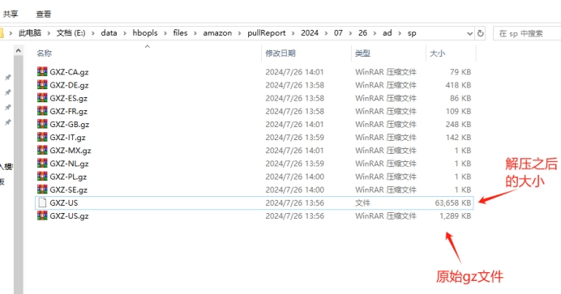
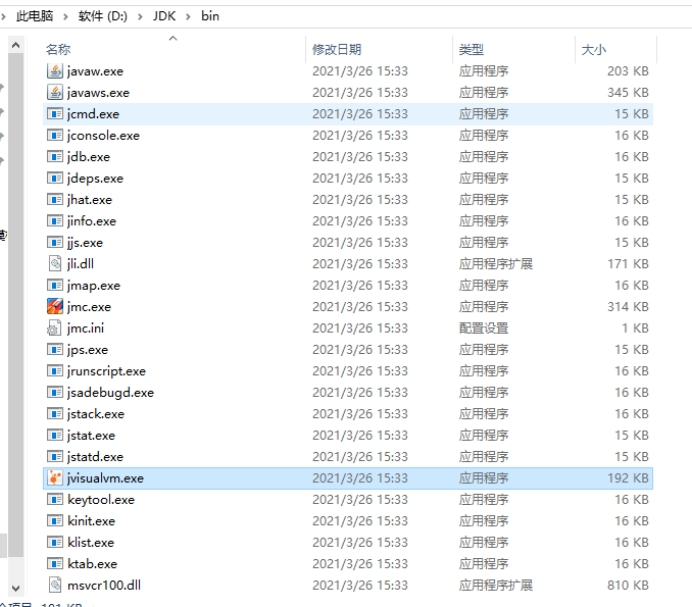
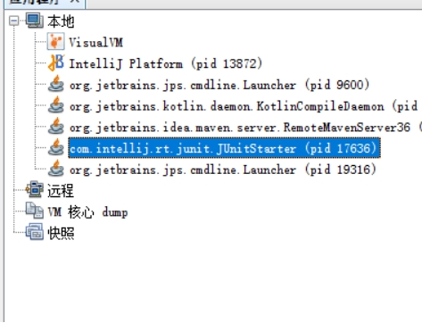
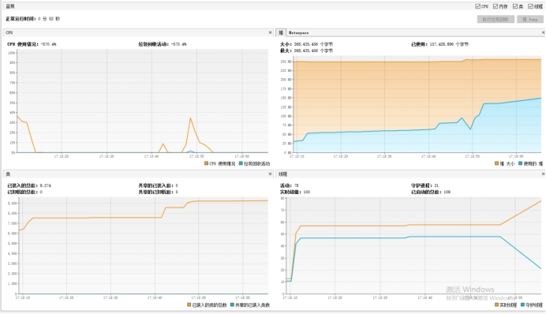
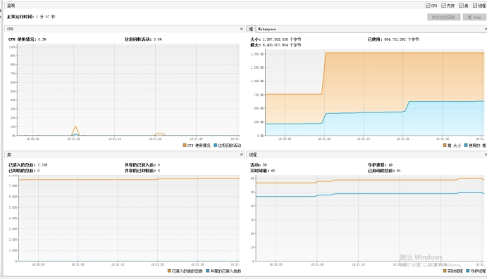
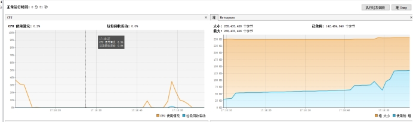

# 📤 大文件解析优化：如何避免OOM异常？

&#x20;

## 大文件解析优化：如何避免OOM异常？

在日常的广告数据处理中，亚马逊广告平台每个月都会在10号和15号拉取上一个月的数据。由于数据量庞大，文件解析时常常会出现**OOM（Out Of Memory）异常**，导致服务崩溃。本文将详细介绍如何通过内存优化来解决这一问题，确保服务稳定运行。

***

### 一、问题背景

亚马逊广告数据量庞大，解析时容易触发OOM异常，导致服务挂掉。以下是任务的原始文件示例：

<figure><figcaption><p>file</p></figcaption></figure>

### 二、内存检测工具

为了定位内存问题，我们可以使用**JDK自带的jvisualvm.exe**工具。通过该工具，我们可以监控JVM的内存使用情况，找到内存泄漏或内存占用过高的原因。

<figure><figcaption><p>jvisualvm.exe</p></figcaption></figure>

打开工具后，找到我们执行的Junit测试类，双击可以查看具体的内存使用情况：

<figure><figcaption><p>内存监控</p></figcaption></figure>

<figure><figcaption><p>内存使用详情</p></figcaption></figure>

***

### 三、原始解析方法及问题分析

在原始的解析方法中，未设置内存大小，导致JVM使用了最大内存。以下是原始解析方法的内存使用情况：

#### 解析方法

```java
/**
 * 任务数据入库
 * @param task 任务
 * @param accTokenDTo token信息
**/
public void saveDb (PlsAmazonAdReportTask task, PlsAmazonAdAccTokenDT0 accTokenDTo) throws Exception {
    L0GGER.info(message:"亚马逊广告报表解析", task.getId());
    FileInputStream fin = new FileInputStream(task.getFilePathLocal());//解析文件 避免内存溢出 拆分
    //读取文件
    String jsonResponse = Fileutility.unzipGz(fin, charEncoding.UTF_8);
    // ...
}
```

#### 解压方法

```java
/**
 * 解压gz成字符串
 * @param fin 输入流
 * @param charSet 输出字符编码
 * @return
 * @throws IOException
 */
public static String unzipGz(FileInputStream fin,String... charSet) throws IOException {
    // gzip解压
    try (GZIPInputStream ginzip = new GZIPInputStream(fin)) {
        byte[] buffer = new byte[1024];
        int offset;
        try (ByteArrayOutputStream out = new ByteArrayOutputStream()) {
            while ((offset = ginzip.read(buffer)) != -1) {
                out.write(buffer, 0, offset);
            }
            if(charSet!=null&&charSet.length>0){
                return out.toString(charSet[0]);
            }
            return out.toString("UTF-8");
        }
    }
}
```

#### 测试代码

```java
@Test
public void test1() throws IOException, InterruptedException {
    String path = "E:\\data\\hbopls\\files\\amazon\\pullReport\\2024\\07\\26\\ad\\sp\\GXZ-US.gz";
    FileInputStream fin = new FileInputStream(path);
    String jsonResponse = FileUtility.unzipGz(fin, CharEncoding.UTF_8);
    List<Object> objects = JSON.parseArray(jsonResponse, Object.class);
    System.out.println("end size:"+objects.size());
}
```

未设置内存大小，JVM申请了超过1.5GB的堆内存，实际使用为660MB：

<figure><figcaption><p>堆内存使用</p></figcaption></figure>

可以看到读取文件后堆内存有两次显著增加，分别是**解析zip**和将**json转成业务对象**，这很容易导致OOM异常。

***

### 四、新的解决方案：流式解析

为了避免一次性加载大量数据导致内存溢出，我们采用了**流式解析**的方法，即边解析边处理，而不是一次性将所有内容加载到内存中。

#### 流式解析代码

```java
public static void main(String[] args) throws Exception {
    Thread.sleep(10000);
    String filePath = "E:\\data\\hbopls\\files\\amazon\\pullReport\\2024\\07\\26\\ad\\sp\\GXZ-US.gz";
    // 1. 下载 gzip 文件，并直接解压缩
    GZIPInputStream gzipInputStream = new GZIPInputStream(new FileInputStream(filePath));
    // 2. 使用 JSONReader 流式解析解压缩后的文件内容
    BufferedReader bufferedReader = new BufferedReader(new InputStreamReader(gzipInputStream));
    // 创建JsonFactory和ObjectMapper实例
    JsonFactory jsonFactory = new JsonFactory();
    ObjectMapper objectMapper = new ObjectMapper(jsonFactory);
    List<Object> list = new ArrayList<>();
    try (JsonParser jsonParser = jsonFactory.createParser(bufferedReader)) {
        // 确保文件以JSON数组开头
        if (jsonParser.nextToken() != JsonToken.START_ARRAY) {
            throw new IOException("Expected data to start with an array");
        }
        int n=1;
        System.out.println(new Date());
        // 遍历JSON数组中的每个对象
        while (jsonParser.nextToken() != JsonToken.END_ARRAY) {
            // 读取JSON对象并将其解析为JsonNode
            JsonNode node = objectMapper.readValue(jsonParser,JsonNode.class);
            list.add(node);
            // 解析2000条后处理2000条
            if (list.size() > 2000){
                // 模拟处理数据
                list.clear();
            }
            n++;
        }
        System.out.println(n);
    } catch (Exception e) {
        e.printStackTrace();
    }
}
```

#### 1. 未设置内存大小的情况

*   • **解析出所有数据再一次性保存**：

    <figure><figcaption><p>img</p></figcaption></figure>

    申请了1.5GB的堆内存，实际使用为660MB。
*   • **解析2000条保存2000条**：

    <figure><figcaption><p>img</p></figcaption></figure>

    申请了超过1GB的堆内存，实际使用为300MB左右。

#### 2. 设置最大内存为256MB的情况

<figure><figcaption><p>img</p></figcaption></figure>

*   • **解析出所有数据再一次性保存**：

    <figure><figcaption><p>img</p></figcaption></figure>

    <figure><figcaption><p>img</p></figcaption></figure>

    可以看到直接内存溢出了。
*   • **解析2000条后处理2000条**：

    <figure><figcaption><p>img</p></figcaption></figure>

    申请了超过256MB的堆内存，实际使用为130MB左右，内存相对`解析出所有数据再一次性保存`少了很多。

***

### 五、结论

通过对比不同的解析方法，我们可以得出以下结论：

* • **大文件解析时，使用流式解析**，即边解析边处理，解析一部分处理一部分，能够有效减少内存消耗，避免OOM异常。
* • **设置合理的最大内存限制**，可以进一步控制内存使用，确保服务稳定运行。

***

**关注海鸥技术部落**，获取更多技术干货和解决方案！如果你有任何问题或建议，欢迎在评论区留言讨论。

&#x20;
