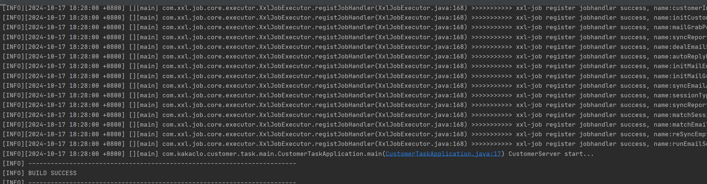
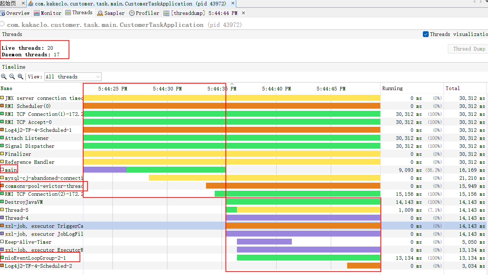
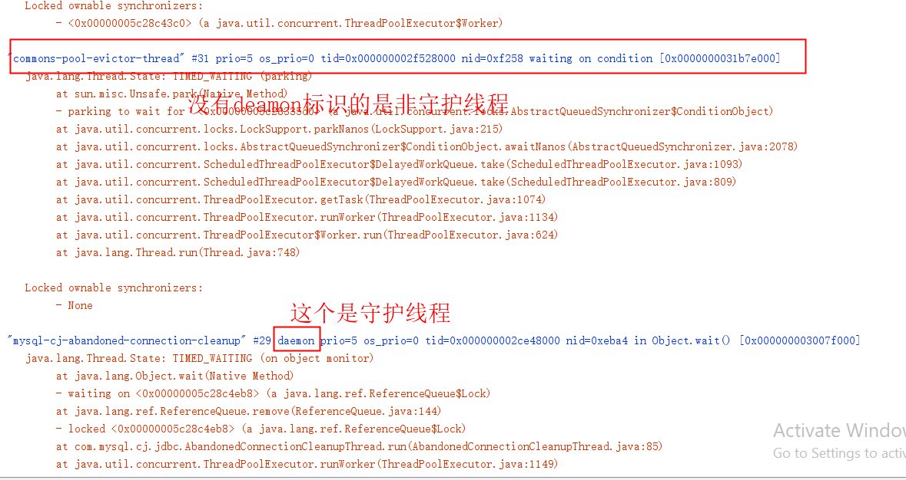
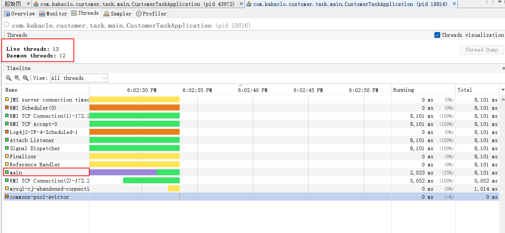
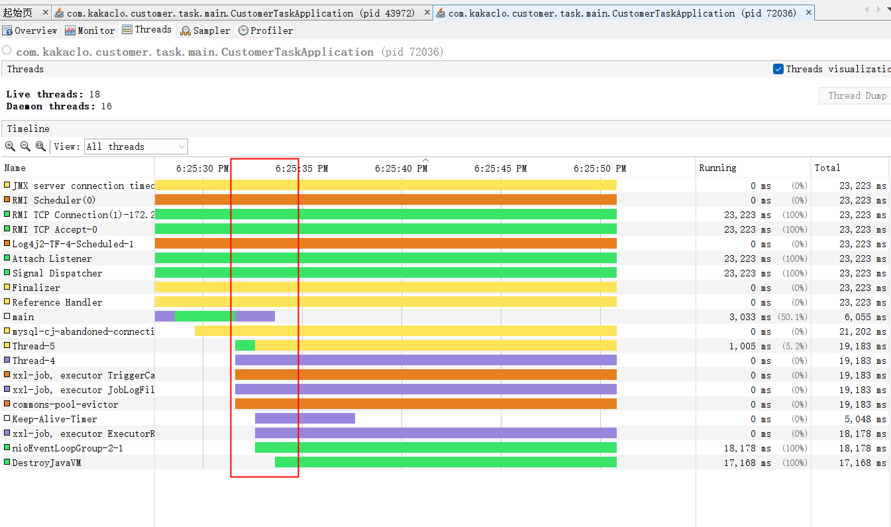

# 🛑 记一次库版本升级引起程序自动停止

### 记一次库版本升级引起程序自动停止

最近我们的应用升级了jedis 版本,版本从 2.10.2 升级 到3.8.0。发现我们的任务应用启动后立马自动关闭了。

这就奇怪了，为什么升级个版本，会导致程序启动后自动关闭呢。带着这个疑问我们看下代码。

表现如下，

<figure><figcaption></figcaption></figure>

程序main线程运行完，直接结束了。

### 0.前置知识，java程序什么时候会结束？

Java程序通常在以下几种情况下结束：

1. **主线程执行完成**：如果主线程运行完毕，且没有其他非守护线程运行，程序就会结束。主线程指的是程序的 `main()` 方法所在的线程。
2. **调用 `System.exit(int status)` 方法**：调用 `System.exit()` 方法可以强制结束程序，`status` 参数为0表示正常退出，非0表示异常退出。
3. **所有非守护线程结束**：当所有非守护线程（非 `Daemon` 线程）结束时，程序也会自动退出。守护线程不会阻止程序结束，当没有非守护线程时，守护线程自动停止。
4. **出现未捕获的异常**：如果在某个线程中出现未捕获的异常，且这个异常终止了主线程或所有非守护线程，程序也会结束。
5. **外部操作强制终止**：程序也可能因外部操作（如操作系统关闭、手动杀死进程等）而被终止。

通过这些方式，Java程序可以结束或退出。

简单分析一下得出，我们的应该运行在打印出CustomerServer start... 就是自动退出了,没有其他报错 ，应该就是第一种情况。主线程执行完成，

要满足主线程执行完成程序结束我们需要条件是:

1.**主线程运行完毕**

2.**没有其他非守护线程运行**

### 1.守护线程与用户线程

java中分为两种线性 守护线程（daemon）与用户（user）线程。

守护线程（Daemon Thread）是Java中一种特殊的线程，主要用于执行一些辅助任务，如垃圾回收、缓存管理等。与普通线程（非守护线程）相比，守护线程的特点是它会在所有非守护线程结束后自动关闭。这意味着当应用程序中没有非守护线程在运行时，JVM会自动关闭所有守护线程。

用户线程 默认情况下我们创建的线程或线程池都是用户线程。

下面有个简单例子，我们简单测试下。

```java
/**
 * songxulin
 */
public class Test {
​
    public static void main(String[] args) throws Exception {
        Thread thread = new Thread(new Runnable() {
                    @Override
                    public void run() {
                        for (int i = 1; i <= 10; i++) {
                            // 打印 i 信息
                            System.out.println("i:" + i + ",isDaemon:" +
                                    Thread.currentThread().isDaemon());
                            try {
                                // 休眠 100 毫秒
                                Thread.sleep(100);
                            } catch (InterruptedException e) {
                                e.printStackTrace();
                            }
                        }
                    }
                });
                // 设置为守护线程
                thread.setDaemon(true);
                // 启动线程
                thread.start();
                System.out.println("hello");
    }
    
}
```

运行结果

```
hello
i:1,isDaemon:true
```

可以发现当我们主线程执行完成后，thread没有继续输出，程序就结束。

将thread.setDaemon(true); 注释再运行

```
hello
i:1,isDaemon:false
i:2,isDaemon:false
i:3,isDaemon:false
i:4,isDaemon:false
i:5,isDaemon:false
i:6,isDaemon:false
i:7,isDaemon:false
i:8,isDaemon:false
i:9,isDaemon:false
i:10,isDaemon:false
```

我们主线程执行完成后，thread继续输出，程序才结束。

### 2.代码分析

有了上面的结论后我们分析下我们自己的代码。 我们这个项目是一个任务项目所以我们没有使用springboot而是一个传统的spring项目。 主要使用到的库有 mybatis、spring、xxl，jedis。

```java
public class CustomerTaskApplication {
​
    private static final Logger LOGGER = LogManager.getLogger(CustomerTaskApplication.class);
​
    public static void main(String[] args) throws Exception {
        ClassPathXmlApplicationContext context = new ClassPathXmlApplicationContext("classpath:applicationContext.xml");
​
        LOGGER.info("CustomerServer start...");
    }
​
}
```

上面这个是入口类，就是简单初始化了spring容器。我们知道spring容器会将所有的bean对象进行初始化。 初始化时不同库会进行一些初始化逻辑，初始化逻辑里面也会启动一些线程池。如 数据库连接池，redis连接池。 初始化完成后我们的main方法接结束了。这时主线程已经运行完成结束了。

我们想要保证我们的程序不会自动停止肯定需要有 非 daemon线程运行。也就是再main方法执行完 之前我们需要启动至少一个用户线程，保证程序不会停止。

### 3.线程分析

想要知道为什么使用jedis 2.10.2程序不会退出，升级到3.8.0后程序会退出。我们得分析下线程运行情况，如果分析呢？我们可以使用`jdk`自带的`jvisualvm`进行分析。

#### jedis 2.10.2版本

我们先启动下jedis 2.10.2 版本下的应用，打开jvisualvm分析Theads的运行情况。

<figure><figcaption></figcaption></figure>

可以看到，在主线程结束前有这些线程在运行，也就是说在这些线程里面必须至少有一个是非守护线程。我们点击 `thread dump`,查看具体的栈信息。

我们发现 `commons-pool-evictor-thread`这个线程使用 非守护线程，而且一直处于运行状态。

<figure><figcaption></figcaption></figure>

因此 在Main主线程结束后，程序不会立刻停止。

我持续运行程序，发现后面 `nioEventLoopGroup-2-1` 这个线程也是一个常驻的用户线程。这个线程会在main线程结束后运行。

#### jedis 3.8.0版本

接下我们测试下 jedis 3.8.0升级后的版本

<figure><figcaption></figcaption></figure>

启动程序后我们发现，程序在主线程结束后程序立马结束了。我们发现 live threads 有13个 ，deamon threads有12个，由于main线程一定为用户线程因此因此其他的线程均为守护线程。

到此我们基本可以总结出程序停止的原因了

#### 分析结果

在此我们可以得出结论，我们jedis 包升级后 `commons-pool-evictor-thread` 从用户线程变为 守护线程，因此应用在主线程结束后，由于没有发现其他存活的用户线程（或者还没来得及启动），因此程序会立即结束。

关于`commons-pool-evictor-thread` 改为守护线程可以查看 [https://github.com/redis/jedis/issues/1956](https://github.com/redis/jedis/issues/1956)。

### 4.代码调整

我们想要程序不立马结束，我们得在在主线程结束后，至少要保证一个用户线程存活。从前面得分析我们得出 在程序运行一段时间后 `nioEventLoopGroup-2-1`会启动。这个线程是`xxl-job, executor ExecutorRegistryThread`是启动的,而这个线程又是在spring 容器初始化bean对象是启动的。

由于我们main程序初始化spring容器后立马结束，因此`xxl-job, executor ExecutorRegistryThread`还没来得及启动 `nioEventLoopGroup-2-1`线程。所以由于没有用户线程在，导致程序立马结束了。

应该我们只需要让main线程等待一会让`nioEventLoopGroup-2-1`线程运行起来，这样由于有用户线程存在，程序不会停止。

下面我们调整一下代码，让主线程等待一会。

```java
/**
 * songxulin
 */
public class CustomerTaskApplication {
​
    private static final Logger LOGGER = LogManager.getLogger(CustomerTaskApplication.class);
​
    public static void main(String[] args) throws Exception {
        ClassPathXmlApplicationContext context = new ClassPathXmlApplicationContext("classpath:applicationContext.xml");
​
        LOGGER.info("CustomerServer start...");
        //进程等待一会再退出
        Thread.sleep(60000);
    }
​
}
```

<figure><figcaption></figcaption></figure>

主线程等待一会后，`nioEventLoopGroup-2-1`非守护线程启动，因此程序不会结束，而是继续运行下去。

### 5.总结

遇到程序结束我们需要对jvm程序结束需要有了解，对应这个情况，本质上是需要我们对 deamon线程和用户线程有一定得理解。然后需要我们结合jvm工具分析程序得运行情况。

原文：\
[https://blog.csdn.net/AndCo/article/details/143025804?spm=1001.2014.3001.5502](https://blog.csdn.net/AndCo/article/details/143025804?spm=1001.2014.3001.5502)
