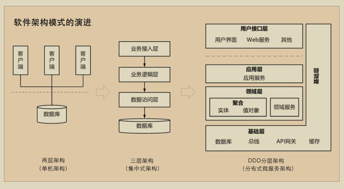
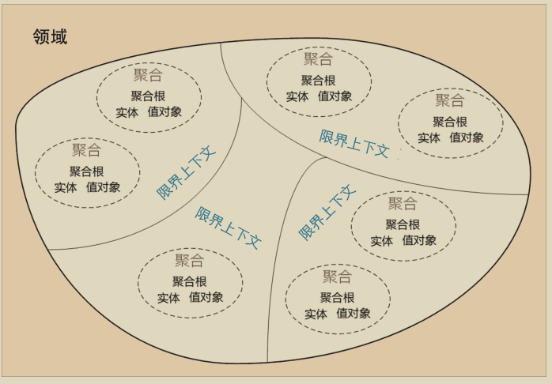
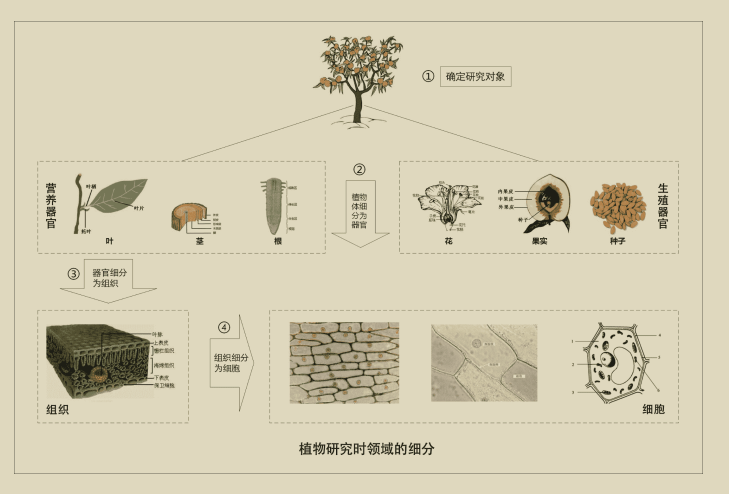
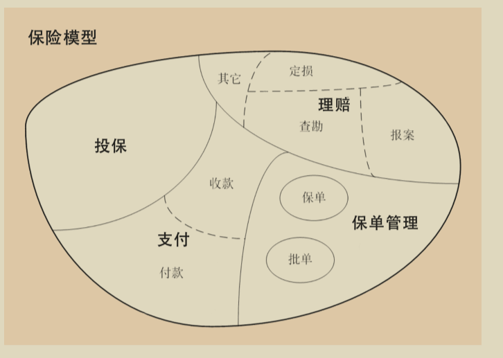

# DDD 简单入门

## DDD 简单入门

### 本文目标

* 培养业务思维
* 建立自洽的设计决策逻辑 （需不需要做，怎么做收益高）
* 清晰表达 业务架构 > 技术架构

本次内容将聚焦于**战略设计（设计思想）**，暂不涉及战术架构（技术细节）。

### 一、前置知识

* **开发经验**：至少3年，最好5年以上
* **业务架构理解**：熟悉业务架构的基本概念
* **设计模式与原则**：掌握常见设计模式、设计原则，理解分层架构和MVC模式
* **Conway定律**：理解其含义及其对系统设计的影响

#### Conway定律

**“设计系统的架构受制于产生这些设计的组织的沟通结构。”** 简而言之，组织内部的沟通方式和团队结构直接影响软件系统的架构设计。

**启示**：

1. 理解系统架构的演进过程
2. 改善团队沟通效率

***

### 二、为什么学习DDD？

<figure><figcaption></figcaption></figure>

随着业务系统的快速变化和日益复杂，传统的开发方法已难以应对。对于小型、简单且稳定的业务项目，DDD可能并非必要，但在复杂业务场景中，DDD的价值尤为突出。

#### 1. 软件架构模式的演变

在单机、集中式架构时代，系统分析、设计和开发往往是割裂的。例如，需求提出、分析、设计和实现由不同人员负责，导致信息丢失和需求偏差。最终，系统功能可能与实际需求相差甚远。

#### 2. 微服务设计与拆分的困境

微服务架构虽然解决了部分问题，但随着业务复杂度的增加，微服务的拆分和设计变得困难。**微服务的边界**常常成为争议的焦点。而DDD通过清晰的领域划分，能够有效解决微服务边界模糊的问题。

***

### 三、DDD简介

2004年，埃里克·埃文斯（Eric Evans）出版了《领域驱动设计》（Domain-Driven Design – Tackling Complexity in the Heart of Software），标志着DDD的诞生。DDD的核心思想是通过领域模型定义业务边界，确保业务模型与代码模型的一致性。

#### DDD的核心价值：

1. **消除技术与业务的鸿沟**
2. **通过领域模型管理复杂性**
3. **构建可持续演进的软件系统**

DDD是一种处理复杂业务领域的设计思想，旨在分离技术实现的复杂性，围绕业务概念构建领域模型，从而解决软件难以理解和演进的问题。

#### DDD的组成部分：

* **战略设计**：从业务视角出发，建立领域模型，划分领域边界，定义限界上下文。
* **战术设计**：从技术视角出发，实现领域模型，包括聚合根、实体、值对象、领域服务等技术细节。

***

### 四、DDD与微服务/MVC的关系

#### DDD与微服务

* **DDD**：从业务视角划分领域边界，构建通用语言，通过领域模型维持业务与代码的一致性。
* **微服务**：关注运行时进程间通信、容错和故障隔离，实现去中心化数据管理和服务治理。

DDD不仅适用于微服务设计，也可用于单体应用。

#### DDD与MVC

* **DDD**：解决复杂业务问题，强调业务逻辑。
* **MVC**：解决UI与业务逻辑的分离，适合UI开发。

简而言之，DDD的战略设计用于微服务划分，战术设计用于业务代码实现，可替代MVC。

***

### 五、战略设计实施

DDD的落地对团队要求较高，需要对业务有深刻理解，并确保开发人员与业务方高效沟通。DDD架构比传统架构复杂，技术要求较高，适合复杂业务场景。对于简单业务，MVC可能更为合适。

#### 战略设计核心概念：

**1. 识别领域与定义核心域（Core Domain）**

<figure><figcaption></figcaption></figure>

**核心域**是业务中最具战略价值的部分，是系统设计的重点。

<figure><figcaption></figcaption></figure>

**实施步骤**：

1. **业务价值评估**：与业务专家沟通，评估各领域的战略价值。
2. **确定核心域**：识别最具价值的业务领域。
3. **聚焦核心域开发**：优先确保核心域的高质量实现。

**2. 建立统一语言（Ubiquitous Language）**

**统一语言**是团队中一致使用的术语，用于消除沟通歧义。

**实施步骤**：

1. **定义术语**：与业务专家共同定义关键术语。
2. **推广使用**：在文档、代码、会议中使用统一语言。
3. **持续更新**：随业务发展更新统一语言。

**3. 限界上下文（Bounded Context）**

<figure><figcaption></figcaption></figure>

**限界上下文**是领域模型的边界，用于隔离不同业务逻辑。

用来封装通用语言和领域对象，提供上下文环境，保证在领域之内的一些术语、业务相关对象等（通用语言）有一个确切的含义，没有二义性。

如上图中的收款，报案就是限界上下文

**实施步骤**：

1. **识别业务子域**：如订单管理、库存管理等。
2. **划分限界上下文**：每个子域对应一个或多个上下文。
3. **定义边界**：明确上下文的职责，避免跨上下文依赖。

***

### 六、常见问题的DDD解决思路

#### 1. 问题：业务逻辑复杂，难以维护

**解决思路：**

* **限界上下文（Bounded Context）**：将复杂的业务逻辑划分到不同的业务模块中。例如，将订单管理、支付系统和库存管理分别独立处理其业务逻辑。
* **领域模型（Domain Model）**：在每个限界上下文内，构建清晰的领域模型。

#### 2. 问题：跨团队沟通不畅，需求理解不一致

**解决思路：**

* **统一语言（Ubiquitous Language）**：在技术团队和业务团队之间使用一致的术语和表达方式。通过与业务专家共同定义领域术语，确保所有团队成员对需求的理解一致。
* **上下文映射（Context Map）**：使用上下文映射图，展示各个业务模块之间的关系和交互方式，帮助团队成员更好地理解系统的整体架构。
* **定期沟通**：通过定期的会议和沟通渠道，保持各团队之间的信息同步。

#### 3. 问题：系统耦合度高，难以扩展和维护

**解决思路：**

* **限界上下文（Bounded Context）**：使用DDD的限界上下文划分，明确模块边界，降低系统耦合度。
* **防腐层（Anti-Corruption Layer）**：在不同上下文之间引入防腐层，确保上下文之间的依赖关系不会导致模型的污染和耦合。
* **代码重构**：定期重构代码，清理技术债务，确保代码质量和可维护性。

#### 4. 问题：需求频繁变化，系统难以应对

**解决思路：**

* **领域模型的持续演进**：通过不断迭代和演进领域模型，保持系统与业务需求的一致性。使用DDD的方法论，可以更加灵活地应对需求变化。
* **敏捷开发实践**：结合DDD与敏捷开发实践，快速响应需求变化，通过小步快跑的方式逐步实现和改进系统。

#### 5. 问题：缺乏对业务流程的全局视角

**解决思路：**

* **上下文映射（Context Map）**：通过上下文映射图，展示各个限界上下文和业务流程之间的关系，帮助团队成员理解全局业务流程。
* **业务流程建模**：使用业务流程建模工具（如BPMN）来描述业务流程，确保技术团队对业务流程有清晰的理解。

### 七、DDD的启示

对于技术团队我们可以获得如下启示：

#### 1. 以业务为核心

* 技术团队需深入理解业务，确保设计与业务需求一致。
* 通过与业务专家合作，构建符合业务需求的系统。

#### 2. 领域模型驱动开发

* 领域模型是系统设计的核心，确保业务逻辑与技术实现一致。
* 领域模型是业务逻辑的表达工具，促进技术与业务的沟通。

#### 3. 统一语言的使用

* 统一语言（业务人员和开发人员都明确的术语）减少沟通歧义，提高团队协作效率。

#### 4. 持续积累业务领域知识

* 技术团队需不断更新领域知识，以应对业务变化。

***

### 八、DDD带来的价值

1. 更好地理解需求，识别需求的价值
2. 设计更合理的业务与技术架构
3. 编写出业务与开发都能理解的文档，提高沟通效率
4. 保持业务架构与代码架构的一致性，可以显著减低需求调整导致代码bug的几率
5. 技术人员和业务人员扯皮概率大大降低

***

### 结语

领域驱动设计（DDD）不仅仅是一种技术方法论，更是一种以**业务为核心**的**思维方式**。通过DDD，技术团队能够深入理解业务需求，构建出与业务逻辑高度一致的软件系统。

无论你是技术开发者、架构师，还是业务分析师，DDD都能为你提供一种全新的视角，帮助你在复杂的业务场景中游刃有余。开始以DDD的理念思考吧，或许它能让你从纷繁复杂的业务泥潭中抽身，找到清晰的设计路径。

DDD有很多概念和技术机构，通常需要业务人员和开发人员有足够的业务经验和技术理解，对团队要求较高。建议不要直接用DDD的战术架构改造代码，可以先普及DDD的理念，先使用DDD梳理业务需求。

一点展望：DDD设计出来的项目，是以领域划分项目包结构，领域之间只通过限界上下文进行交互，这种模块化，统一出入口的结构非常适用于AI编程，效率起飞甚至可以直接让AI developer开发，真的就是人人都是项目经理了😂，未来可期。

**参考资料**：

1. [Conway定律](https://www.edony.ink/programmer-and-conways-law/)
2. [极客时间DDD实战课](https://time.geekbang.org/column/intro/100037301)
3. [DDD领域驱动设计（油管**FireUG 技术社区**）](https://www.youtube.com/watch?v=_G9meHFz4m8\&list=PLaPfIKRFlV05qqACnpeXiH8epohCO19Pp)

原文：[https://mp.weixin.qq.com/s/DeJUqpBbmHfxYcuLG\_dARQ](https://mp.weixin.qq.com/s/DeJUqpBbmHfxYcuLG_dARQ)
