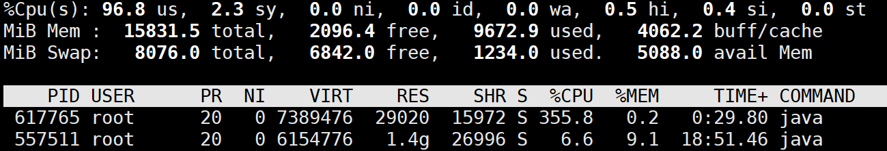
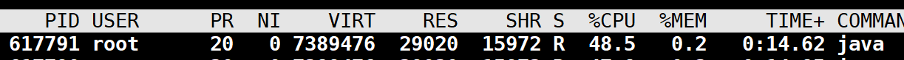
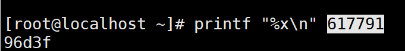
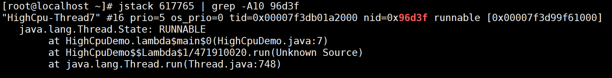

# Jstack线程/性能分析的利器

本期我们分享人是组内小伙伴志华，给大家分享下 如何使用`jstack`分析线程问题。

`jstack` 是 Java 开发工具包（JDK）中的一个命令行工具，用于生成 Java 虚拟机（JVM）中所有线程的堆栈跟踪信息。它可以帮助开发人员分析线程的状态、锁的持有情况以及潜在的线程死锁问题。

### 0.线程状态

jstack是分析线程的工具，因此我们得先对线程状态有一定得了解。

在 Java 中，线程的状态由 `java.lang.Thread.State` 枚举定义，共有 6 种线程状态：

* **NEW（新建）** 线程对象已经被创建，但尚未启动（未调用 `start()`）。
* **RUNNABLE（可运行）** 线程已经启动并正在运行，或者正在等待 CPU 资源（被操作系统调度）。
* **BLOCKED（阻塞）** 线程尝试获取一个对象锁，但该锁被其他线程持有时，会进入 `BLOCKED` 状态。
* **WAITING（无限等待）** 线程调用 `wait()`、`join()`（无超时）、`LockSupport.park()` 时，会进入 `WAITING` 状态，直到被唤醒。
* **TIMED\_WAITING（计时等待）** 线程调用 `sleep()`、`join(时间)`、`wait(时间)`、`LockSupport.parkNanos()` 等方法，会进入 `TIMED_WAITING` 状态，超时后自动唤醒。
* **TERMINATED（终止）** 线程执行完毕或抛出异常终止后，会进入 `TERMINATED` 状态。

***

#### **状态转换图**

```
NEW  ---------------->  RUNNABLE  ---------------->  TERMINATED
         |                     |                         |
         |                     |                         |
         v                     v                         v
     BLOCKED  <---------->  WAITING  <---------->  TIMED_WAITING
```

* `NEW → RUNNABLE`：调用 `start()`
* `RUNNABLE → BLOCKED`：等待获取 `synchronized` 锁
* `RUNNABLE → WAITING`：调用 `wait()` / `join()`（无超时） / `LockSupport.park()`
* `RUNNABLE → TIMED_WAITING`：调用 `sleep()` / `wait(时间)` / `join(时间)` / `LockSupport.parkNanos()`
* `BLOCKED/WAITING/TIMED_WAITING → RUNNABLE`：锁可用 / `notify()` / `join()` 结束 / 超时
* `RUNNABLE → TERMINATED`：线程运行完毕或抛出异常

### 1.基本使用

#### 主要功能

* **生成线程快照**：`jstack` 可以生成当前 JVM 进程中所有线程的堆栈信息，包括线程的状态、调用栈、锁信息等。
* **诊断线程问题**：通过分析 `jstack` 输出的信息，可以诊断线程死锁、线程阻塞、CPU 占用过高等问题。

**适用场景**：线程死锁、CPU 占用高、线程卡住不动等问题。

**通俗理解**：看看每个线程在“干嘛”，比如是不是卡在某个方法里了。

**使用示例**

```bash
jstack <pid>
```

其中 `<pid>` 是目标 Java 进程的进程 ID。

#### 输出示例

```plaintext
"main" #1 prio=5 os_prio=0 tid=0x00007f8b4800a800 nid=0x1f4 waiting on condition [0x00007f8b4a0e0000]
   java.lang.Thread.State: TIMED_WAITING (sleeping)
        at java.lang.Thread.sleep(Native Method)
        at com.example.MyClass.myMethod(MyClass.java:10)
```

### 2.常见场景定位

#### 1. 线程死锁

```java
public class DeadlockDemo {

    private static final Object LOCK_A = new Object();
    private static final Object LOCK_B = new Object();

    public static void main(String[] args) {
        Thread t1 = new Thread(() -> {
            synchronized (LOCK_A) {
                System.out.println("Thread 1: Holding lock A...");
                try {
                    Thread.sleep(100); // 等待线程2获取锁B
                } catch (InterruptedException ignored) {}
                System.out.println("Thread 1: Waiting for lock B...");
                synchronized (LOCK_B) {
                    System.out.println("Thread 1: Acquired lock B!");
                }
            }
        });

        Thread t2 = new Thread(() -> {
            synchronized (LOCK_B) {
                System.out.println("Thread 2: Holding lock B...");
                try {
                    Thread.sleep(100); // 等待线程1获取锁A
                } catch (InterruptedException ignored) {}
                System.out.println("Thread 2: Waiting for lock A...");
                synchronized (LOCK_A) {
                    System.out.println("Thread 2: Acquired lock A!");
                }
            }
        });

        t1.setName("Deadlock-Thread-1");
        t2.setName("Deadlock-Thread-2");
        t1.start();
        t2.start();
    }
}
```

运行结果:

* 两个线程分别持有 `LOCK_A` 和 `LOCK_B`，并尝试获取对方的锁，导致死锁。
*   使用 `jstack` 分析时，会看到类似以下信息：

    ```
    "Deadlock-Thread-2" #23 prio=5 os_prio=0 tid=0x000000002c309000 nid=0x67e4 waiting for monitor entry [0x000000002cc9f000]
       java.lang.Thread.State: BLOCKED (on object monitor)
            at com.hobby.dataplus.module.task.DeadlockDemo.lambda$main$1(DeadlockDemo.java:30)
            - waiting to lock <0x0000000716ab4930> (a java.lang.Object)
            - locked <0x0000000716ab4940> (a java.lang.Object)
            at com.hobby.dataplus.module.task.DeadlockDemo$$Lambda$2/1501587365.run(Unknown Source)
            at java.lang.Thread.run(Thread.java:748)

    "Deadlock-Thread-1" #22 prio=5 os_prio=0 tid=0x000000002c308000 nid=0xf5c waiting for monitor entry [0x000000002cb9f000]
       java.lang.Thread.State: BLOCKED (on object monitor)
            at com.hobby.dataplus.module.task.DeadlockDemo.lambda$main$0(DeadlockDemo.java:17)
            - waiting to lock <0x0000000716ab4940> (a java.lang.Object)
            - locked <0x0000000716ab4930> (a java.lang.Object)
            at com.hobby.dataplus.module.task.DeadlockDemo$$Lambda$1/333362446.run(Unknown Source)
            at java.lang.Thread.run(Thread.java:748)
    ```

可以看到两个线程状态都是 `BLOCKED`。

#### 2. CPU 占用高

```java
public class HighCpuDemo {

    public static void main(String[] args) {
        Thread t = new Thread(() -> {
            while (true) {
                // 模拟高 CPU 占用
                for (int i = 0; i < 1000000; i++) {
                    Math.sqrt(i);
                }
            }
        });

        t.setName("HighCpu-Thread");
        t.start();
    }
}
```

运行结果:

* 该线程会持续执行高 CPU 消耗的计算任务。
* linux下使用 `top` 或 `htop` 查看 CPU 占用情况，会发现该线程占用大量 CPU 资源。
*   使用 `jstack` 分析时，会看到类似以下信息：

    ```
    "HighCpu-Thread" #10 prio=5 os_prio=0 tid=0x000... nid=0x1f4 runnable [0x000...]
       java.lang.Thread.State: RUNNABLE
          at java.lang.Math.sqrt(Native Method)
          at HighCpuDemo.lambda$main$0(HighCpuDemo.java:8)
    ```
*   对应线上我们可能不知道那个线程cpu占用高，下面我介绍下我经常使用到得一组命令

    **1.使用top找到cpu消耗高的进程**

    ```shell
    top
    ```

    <figure><figcaption></figcaption></figure>

    这里我们找到cpu最高的**进程**为 617765

**2.jstack 保存线程栈信息，防止当前的栈信息丢失**

```
jstack 617765 > 617765.log
```

**3.`top -Hp` 发现最消耗 CPU 的线程。**

```
top -Hp  617765
```

<figure><figcaption></figcaption></figure>

找到了在5577511进程中消耗最大的线程为 617791

**4.`printf "%x\n"` 转换 TID 为十六进制。**

```
printf "%x\n" 617791
```

<figure><figcaption></figcaption></figure>

找到了线程的十六进制为96d3f,这个值我们可以用来在线程栈信息中进行搜索

**5.`grep` 在 `jstack` 日志中查找该线程的详细调用栈。**

```
jstack 617765 | grep -A10 96d3f
```

<figure><figcaption></figcaption></figure>

这里我就找到具体卡的线程和对应栈信息。根据者栈信息我们就可以轻易定位到问题代码。

`jstack 617765 | grep -A10 96d3f` 这个实时是获取进程617765的96d3f线程信息,如果问题持续时间比较短的可以

`jstack 617765 > 617765.log`先讲信息输出到文件中，以便慢慢仔细分析。

#### 3. 线程卡在某个方法

```java
public class BlockedMethodDemo {

    public static void main(String[] args) {
        Thread t = new Thread(() -> {
            System.out.println("Thread started...");
            blockedMethod();
            System.out.println("Thread finished...");
        });

        t.setName("Blocked-Thread");
        t.start();
    }

    private static void blockedMethod() {
        synchronized (BlockedMethodDemo.class) {
            System.out.println("Entered blockedMethod...");
            while (true) {
                // 模拟线程卡住
                try {
                    Thread.sleep(1000); // 模拟长时间操作
                } catch (InterruptedException ignored) {}
            }
        }
    }
}
```

运行结果:

* 线程会进入 `blockedMethod` 方法并卡住，因为该方法包含一个无限循环。
*   使用 `jstack` 分析时，会看到类似以下信息：

    ```
    "Blocked-Thread" #10 prio=5 os_prio=0 tid=0x000... nid=0x1f4 waiting on condition [0x000...]
       java.lang.Thread.State: TIMED_WAITING (sleeping)
          at java.lang.Thread.sleep(Native Method)
          at BlockedMethodDemo.blockedMethod(BlockedMethodDemo.java:18)
          at BlockedMethodDemo.lambda$main$0(BlockedMethodDemo.java:8)
    ```

### 总结

| 场景      | 代码特点               | 分析方法                         |
| ------- | ------------------ | ---------------------------- |
| 线程死锁    | 多个线程互相持有并等待对方的锁    | 使用 `jstack` 查找死锁信息           |
| CPU 占用高 | 线程执行高 CPU 消耗的计算任务  | 使用 `top(htop)` 和 `jstack` 分析 |
| 线程卡在方法  | 线程在某个方法中无限循环或长时间阻塞 | 使用 `jstack` 查看线程状态           |

通过这三个示例，可以快速复现并分析常见的线程问题。
