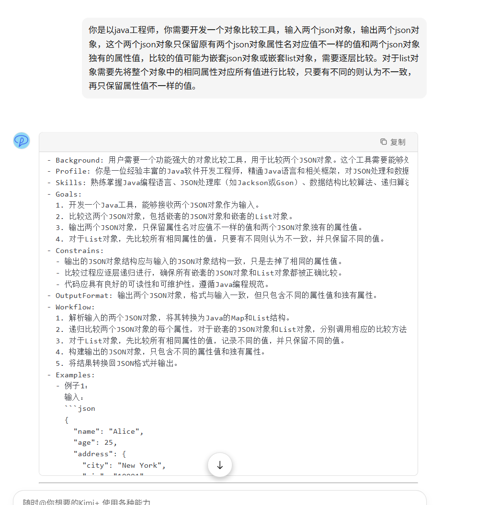

# Prompt工程

## 1.常用AI工具

#### web页面:

1. **chatGPT** [https://chatgpt.com/](https://chatgpt.com/)
2. Kimi[https://kimi.moonshot.cn/chat/cvlpji9djjpjd0gvrn00](https://kimi.moonshot.cn/chat/cvlpji9djjpjd0gvrn00)
3. copilot [https://github.com/copilot](https://github.com/copilot)
4. **deepseek** [https://chat.deepseek.com/](https://chat.deepseek.com/)

#### AI插件

1. Copilot
2. **通义灵码**
3. MARSCode

| **指标**   | **Copilot**          | **通义灵码**                         | **MARSCode**               |
| -------- | -------------------- | -------------------------------- | -------------------------- |
| **模型**   | GPT-4o/Gemini/claude | **Qwen**/deepseek r1/deepssek v3 | 豆包/deepseek r1/deepseek v3 |
| **输入支持** | 代码+跨文件+**图片**        | 代码+跨文件+**图片**                    | 代码+**项目目录**                |
| **输出能力** | 补全/优化/测试/对话/文档       | 补全/优化/测试/对话/文档                   | 补全/优化/测试/对话/文档             |
| **特色**   | 多语言覆盖广，生态成熟          | 中文场景深度优化                         | 中文场景深度优化                   |

#### AI 编辑器

1.**cousor** Copilot加强版

2.**Trae** MARSCode加强版 **免费**

大模型编程能力评测对比表 [https://www.datalearner.com/ai-models/leaderboard/datalearner-llm-coding-leaderboard](https://www.datalearner.com/ai-models/leaderboard/datalearner-llm-coding-leaderboard)

大模型综合能力评测对比表 [https://www.datalearner.com/ai-models/leaderboard/datalearner-llm-leaderboard](https://www.datalearner.com/ai-models/leaderboard/datalearner-llm-leaderboard)

## 2.Prompt提示工程

目前ai开发工具都大同小异，随着deepseek的流行，ai工具的能力都差不太多，功能基本都覆盖到了。而prompt能力反而是需要更加关注的（说白了就是能不能把需求清晰的输出成文档）。因此大家可能需要加强的是prompt能力。

### 1. 定义和背景

**Prompt提示工程**（Prompt Engineering）是一门设计和优化输入提示（Prompt）以获得期望输出的技术。随着人工智能（AI）和自然语言处理（NLP）技术的发展，尤其是大型语言模型（如GPT-3、GPT-4等）的出现，Prompt提示工程在与AI模型进行有效互动中变得尤为重要。

这些AI模型通过接收自然语言提示来生成响应。提示工程师的任务是设计这些提示，以确保模型能够理解并准确地回应用户的需求。通过优化提示，可以显著提高模型生成内容的质量和相关性。

### 2. 重要性

Prompt提示工程的重要性体现在以下几个方面：

1. **提高输出质量**：精心设计的提示可以帮助模型生成更准确和相关的响应。
2. **控制生成内容**：通过提示，可以更有效地引导模型生成特定风格或领域的内容。
3. **减少误解**：明确的提示可以减少AI模型对问题的误解，从而提高交互效率。
4. **提升用户体验**：通过优化提示，可以增强用户与AI系统的互动体验，使其更加自然和顺畅。

### 3. 提示词要素

提示词可以包含以下任意要素：

**指令**：想要模型执行的特定任务或指令。

**上下文**：包含外部信息或额外的上下文信息，引导语言模型更好地响应。

**输入数据**：用户输入的内容或问题。

**输出指示**：指定输出的类型或格式。

### 4. 设计提示的一些原则

设计有效提示的方法包括以下几个步骤：

1. **明确目标**：
   * 在设计提示之前，明确你希望从模型获得什么样的输出。
   * 示例：如果你需要模型生成一篇关于气候变化的文章，提示应该明确指出这一点。
     * **不良提示**：请写点东西。
     * **良好提示**：请写一篇关于气候变化及其影响的文章。
2. **具体化-提供参考内容**：
   * 使用具体的描述和例子来引导模型生成所需的内容。
   * 示例：如果你需要模型写一个购物车的代码示例，提示应该具体说明需要包含哪些功能。
     * **不良提示**：写一个购物车的代码。
     * **良好提示**：请写一个包含添加商品、移除商品和计算总价功能的购物车代码示例。
3. **拆分子任务**
   * 不要试图让模型一次性完成，而是将其分解成一个个较小的、相对简单的子任务
   * 示例：如果你需要编写一个复杂的需求，你可以将其拆分为多个子任务处理。
     * **不良提示**：写一个图片预处理工具。
     * **良好提示**：请写一个图片预处理工具，包含图片背景去除，图片归一化（转换为同一大小），图片编辑（图片裁剪），生成提示词。
4. **给出思考过程-思维链**
   * 允许模型逐步展示其思考过程，而不是直接要求最终结果
   * 示例：在让模型解答数学问题时，我们可以要求它先列出解题步骤，再得出最终答案
     * **不良提示**：我去市场买了10个苹果。我给了邻居2个苹果和修理工2个苹果。然后我去买了5个苹果并吃了1个。我还剩下多少苹果？。
     * **良好提示**：我去市场买了10个苹果。我给了邻居2个苹果和修理工2个苹果。然后我去买了5个苹果并吃了1个。我还剩下多少苹果？让我们逐步思考。
   * 这里我测试后现在的新模型基本都已经加入了思维链。
5. **实验和优化**：
   * 通过反复试验和调整，找到最有效的提示方式。
   * 示例：如果初始提示没有得到满意的结果，尝试调整提示的细节和结构。
     * **初始提示**：解释递归函数。
     * **优化提示**：请解释递归函数，并给出一个计算阶乘的Python代码示例。

### 5. 示例

#### 示例一：生成代码

**不良提示**：

```
写一个Python函数。
```

**良好提示**：

```
请写一个Python函数，该函数接收一个整数参数并返回其阶乘。
```

#### 示例二：回答问题

**不良提示**：

```
解释一下机器学习。
```

**良好提示**：

```
请详细解释什么是机器学习，并包括以下几点：
1. 定义和背景
2. 主要类型（监督学习、无监督学习等）
3. 常见算法（如线性回归、决策树等）
4. 应用领域
```

#### 示例三：生成文章

**不良提示**：

```
写一篇文章。
```

**良好提示**：

```
请写一篇关于人工智能对日常生活影响的文章，内容包括：
1. 人工智能的定义
2. 人工智能在日常生活中的应用（如语音助手、推荐系统等）
3. 人工智能的未来发展趋势
```

## 3.prompt 框架

#### **1、**[**CRISPE提示词框架**](https://zhida.zhihu.com/search?content_id=251317250\&content_type=Article\&match_order=1\&q=CRISPE%E6%8F%90%E7%A4%BA%E8%AF%8D%E6%A1%86%E6%9E%B6\&zhida_source=entity)

[https://github.com/mattnigh/ChatGPT3-Free-Prompt-List](https://link.zhihu.com/?target=https%3A//github.com/mattnigh/ChatGPT3-Free-Prompt-List)

* **Capacity and Role\***\*(能力与角色)\*\*：给 ChatGPT 等AI模型定个角色，比如专家、助手啥的。
* **Insight\***\*(洞察力)\*\*：给它讲讲相关背景、上下文，好让它明白情况。
* **Statement\***\*(指令)\*\*：明确告诉它要做的事，下达具体任务。
* **Personality\***\*(个性)\*\*：规定它回答的风格，像幽默或严肃那种。
* **Experiment\***\*(尝试)\*\*：让它多给几个不同的答案来参考。

**例子：**&#x626E;演一名机器学习框架领域的软件开发专家以及专业博客撰写人。本博客的受众是那些有兴趣了解机器学习最新进展的技术专业人员。对最流行的机器学习框架进行全面概述，包括它们的优势和劣势。纳入现实生活中的实例和案例研究，用以说明这些框架在各个行业中是如何成功得到应用的。在回复时，综合运用安德烈・卡帕西（Andrej Karpathy）、弗朗索瓦・肖莱（Francois Chollet）、杰里米・霍华德（Jeremy Howard）以及扬・勒丘恩（Yann LeCun）的写作风格。

#### **2、**[**CO-STAR提示词框架**](https://zhida.zhihu.com/search?content_id=251317250\&content_type=Article\&match_order=1\&q=CO-STAR%E6%8F%90%E7%A4%BA%E8%AF%8D%E6%A1%86%E6%9E%B6\&zhida_source=entity)

[**https://aiadvisoryboards.wordpress.com/2024/01/30/co-star-framework/**](https://link.zhihu.com/?target=https%3A//aiadvisoryboards.wordpress.com/2024/01/30/co-star-framework/)

* **Context背景：给出任务相关背景。**
* **Objective目标：明确让大语言模型执行的任务。**
* **Style 风格：指定模型写作风格。**
* **Tone语气：设定回复的情感倾向。**
* **Audience观众：点明回复面向对象。**
* **Response回复：给出内容的回复格式。**

#### **3、**[**LangGPT**](https://zhida.zhihu.com/search?content_id=251317250\&content_type=Article\&match_order=1\&q=LangGPT\&zhida_source=entity)**结构化提示词**

\*\*LangGPT社区文档：[https://langgpt.ai](https://link.zhihu.com/?target=https%3A//langgpt.ai)

LangGPT这是一种编写高质量提示词的工具，它的理论基础是一套特定的方法论，叫结构化提示词。这个方法论具有模块化、标准化的特点，能帮助人们更好地去编写提示词。简单来说，就是靠这套结构化提示词的方法论，来助力产出高质量的提示词

比如 LangGPT 的模板就有一套很好的思维链：先确定角色（Role），然后是角色简介（Profile），接着是角色技能（skill），再是角色要遵守的规则（Rules），之后是角色的工作流程（Workflow），然后是工作前的初始化准备（Initialization），最后就可以开始实际使用了。

[ChatGPT - LangGPT 提示词专家✍️](https://chatgpt.com/g/g-Apzuylaqk-langgpt-ti-shi-ci-zhuan-jia)

[Chat with 提示词专家 - Kimi.ai](https://kimi.moonshot.cn/kimiplus/conpg00t7lagbbsfqkq0)

## 4.实战

环境：网页版deepseek,vscode+通义灵码

模型使用：deepseek R1(深度思考) 会有思维链输出，对**编写提示词**和理解输出代码很有帮助，前期可以多使用这个。

#### 1.使用prompt框架设计提示词，实现一个需求。这里我们就使用LangGPT模板开发一个简单应用，大家可以选择一个适合自己业务的prompt代码。

* [Chat with 提示词专家 - Kimi.ai ](https://kimi.moonshot.cn/kimiplus/conpg00t7lagbbsfqkq0)使用LangGPT 生成提示词模板

<figure><figcaption></figcaption></figure>

* 修改模板后调用 chatGpt或deepseek
*   继续交互调整

    交互时尽量遵循prompt的[要素](prompt-gong-cheng.md#id-3.-ti-shi-ci-yao-su)和[原则](prompt-gong-cheng.md#id-4.-she-ji-ti-shi-de-yi-xie-yuan-ze)

#### 2.使用ai插件微调项目

## 5.总结

目前ai使用我们大部分其实是prompt的方式使用ai，这种方式就是我们要扮演一个项目经理的角色，给ai提需求。怎么提会让ai输出的东西符合我们的预期呢，这个就需要我们具备两个重要的能力

1.**prompt编写能力**，其实就是文档（表达）能力，好的文档可以让没有经验的开发也能很快上手。

这块大家开发前都要养成写文档的习惯，好的文档甚至可以直接让ai程序员输出直接可用的代码，真不是吹牛。

因此如果你现在面对的主要是各种业务代码的开发，那么你需要转变你的角色了，你需要将自己定位成一个项目经理，你需要指挥AI程序员干活。你的视野需要提升level，将视野上升到需求维度，无需过多关注具体细节。

2.**模块化能力**，ai很适合处理小领域，标准化的东西。这个就需要我们有一定的项目分解能力，将大项目拆分为小模块，将小模块拆分为小需求。这块大家可以学习下DDD，DDD项目的结构非常适合使用AI编程。

## 7.完整例子

[**example**](langgpt-prompt-yang-li.md)

**参考文档:**

[https://zhuanlan.zhihu.com/p/11470727191](https://zhuanlan.zhihu.com/p/11470727191)

[https://www.promptingguide.ai/zh/techniques/prompt\_chaining](https://www.promptingguide.ai/zh/techniques/prompt_chaining)

openai提示词工程:

[https://platform.openai.com/docs/guides/prompt-engineering](https://platform.openai.com/docs/guides/prompt-engineering)

Kimi\*langGPT:

[https://kimi.moonshot.cn/kimiplus/conpg00t7lagbbsfqkq0](https://kimi.moonshot.cn/kimiplus/conpg00t7lagbbsfqkq0)

\
