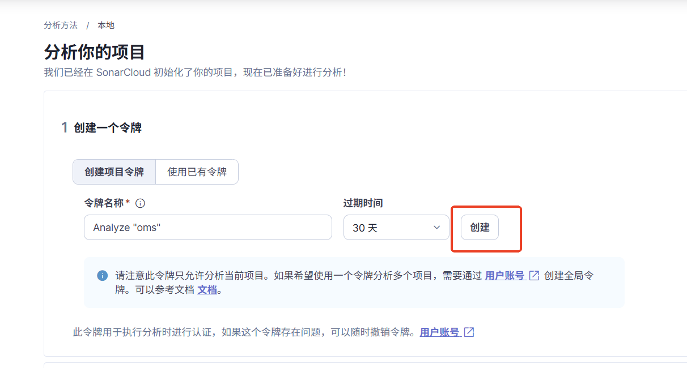
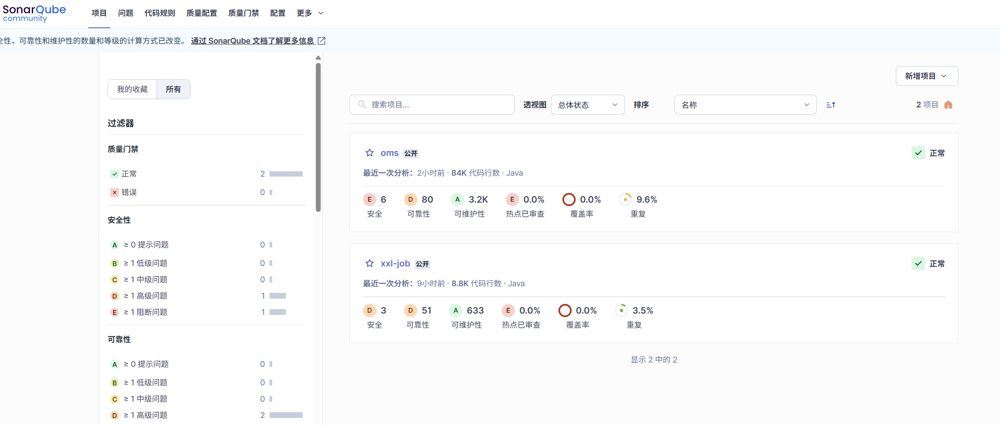

# SonarQube 集成教程

以下是 **SonarQube 集成教程**，涵盖本地部署、项目扫描（以 Java/PHP 为例）的集成流程。

### **1. SonarQube 本地部署**

#### **1.1 快速启动（Docker 方式）**

```sh

# 创建网络和容器
docker network create sonarqube-net
​
# 启动 PostgreSQL 数据库
docker run -d --name sonarqube-db --network sonarqube-net \
  -e POSTGRES_USER=sonar -e POSTGRES_PASSWORD=sonar \
  postgres:13
​
# 启动 SonarQube 服务
docker run -d --name sonarqube --network sonarqube-net \
  -p 9000:9000 -e SONARQUBE_JDBC_URL=jdbc:postgresql://sonarqube-db:5432/sonar \
  -e SONARQUBE_JDBC_USERNAME=sonar -e SONARQUBE_JDBC_PASSWORD=sonar \
  -v sonarqube_data:/opt/sonarqube/data \
  -v sonarqube_extensions:/opt/sonarqube/extensions \
  -v sonarqube_logs:/opt/sonarqube/logs \
  sonarqube:community
```

* 访问 `http://localhost:9000`，默认账号：`admin/admin`。

#### **1.2 手动安装（非 Docker）**

* 下载 SonarQube：[https://www.sonarsource.com/products/sonarqube/downloads/](https://www.sonarsource.com/products/sonarqube/downloads/)
* 配置数据库（PostgreSQL/MySQL/Oracle）。
* 启动：`./bin/[OS]/sonar.sh start`。

***

### **2. 项目扫描**

#### **2.1 Java 项目（Maven 示例）**

**步骤 1：配置 Maven**

在 `pom.xml` 中添加 SonarQube 插件：

```xml
<build>
  <plugins>
    <plugin>
      <groupId>org.sonarsource.scanner.maven</groupId>
      <artifactId>sonar-maven-plugin</artifactId>
      <version>5.1.0.4751</version>
    </plugin>
  </plugins>
</build>
```

这个版本需要和SonarQube的版本对应，不然会报错。

5.1.0.4751对应的jdk11+，3.6.0.1398对应的是jdk8。需要和自己安装的SonarQube对应。

**步骤 2：执行扫描**

<figure><figcaption></figcaption></figure>

```sh
# 指定 SonarQube 地址和令牌（需先在 SonarQube 界面生成）
mvn sonar:sonar \
  -Dsonar.host.url=http://localhost:9000 \
  -Dsonar.login=生成的令牌
```

***

#### 2.2 使用SonarScanner进行扫描

**步骤 1：安装 PHP 插件**

* 一般般默认就有

**步骤 2：使用 SonarScanner**

SonarScanner使用的jdk版本需要和SonarQube的jdk版本对应上。

下载 SonarScanner：[https://docs.sonarqube.org/latest/analysis/scan/sonarscanner/](https://docs.sonarqube.org/latest/analysis/scan/sonarscanner/)

在项目中创建sonar-project.properties文件

```properties
# 配置 sonar-project.properties
sonar.projectKey=my-php-project
sonar.sources=src
```

**步骤 3：运行扫描**

```sh
sonar-scanner \
  -Dsonar.host.url=http://localhost:9000 \
  -Dsonar.login=生成的令牌
```

如果你不想配置sonar-project.properties或者想覆盖sonar-project.properties，可以在命令后面增加如

```
-Dsonar.projectKey=my-php-project1
```

这样配置的优先级会高于sonar-project.properties的配置

#### 2.3 使用docker扫描

使用docker的话使用更加方便，和上面步骤一样

**步骤 1：安装 PHP 插件**

* 一般般默认就有

**步骤 2：使用 SonarScanner**

在项目中创建sonar-project.properties文件

```properties
# 配置 sonar-project.properties
sonar.projectKey=my-php-project
sonar.sources=src
```

**步骤 3：运行扫描**

```sh
docker run --rm \
    -v ${YOUR_CACHE_DIR}:/opt/sonar-scanner/.sonar/cache \
    -v ${YOUR_REPO}:/usr/src \
    -e SONAR_HOST_URL="http://localhost:9000" \
    sonarsource/sonar-scanner-cli \
    -Dsonar.login=生成的令牌
```

***

### **3. 查看报告**

扫描完成后，访问 SonarQube 的 Web 界面（如 `http://localhost:9000`）：

* **仪表盘**：项目健康状态（漏洞、坏味道、覆盖率等）。
* **问题分类**：按严重程度（Blocker/Critical/Major）筛选。
* **历史趋势**：代码质量随时间变化。

<figure><figcaption></figcaption></figure>

***

### **4. 高级配置**

* **自定义规则**：在 `Quality Profiles` 中覆盖默认规则。
*   **排除文件**：在 `sonar-project.properties` 中添加：

    ```
    sonar.exclusions=**/test/**, **/vendor/**
    ```
* **多模块项目**：为每个模块指定扫描路径。

***

### 5.**常见问题**

#### 1.es启动失败

一般会有如下报错

```
bootstrap check failure [1] of [1]: max virtual memory areas vm.max_map_count [65530] is too low
```

原因是 **Elasticsearch 的 `vm.max_map_count` 参数值太低**，需要从默认的 `65530` 提升到至少 `262144`。以下是解决方案：

**Linux/macOS**

编辑 `/etc/sysctl.conf` 文件，添加以下行：

```
vm.max_map_count=262144
```

然后执行：

```sh
sudo sysctl -p  # 重新加载配置
```

**Windows（WSL2）**

在 `%USERPROFILE%\.wslconfig` 文件中添加：

```
[wsl2]
kernelCommandLine = "sysctl.vm.max_map_count=262144"
```

重启 WSL：

```
wsl --shutdown
```

#### 2.语言未安装

一般会有如下报错

```
There are no languages available. You cannot create a new profile.
```

解决方案: 需要到插件市场安装对应的语言

#### 3.sonar-maven-plugin 与运行环境不兼容

一般会有如下报错：

```
org/sonarsource/scanner/maven/SonarQubeMojo has been compiled by a more recent version of the Java Runtime (class file version 55.0), this version of the Java Runtime only recognizes class file versions up to 52.0
```

这是你需要更新sonar-maven-plugin的版本，使其和你的jdk版本适应

* `class file version 55.0` → 编译插件使用的 JDK 11。
* `up to 52.0` → 当前运行的 JDK 8。

**兼容性表**：

| Java 版本 | Class File Version |
| ------- | ------------------ |
| JDK 8   | 52.0               |
| JDK 11  | 55.0               |

方案如下：

**1. 项目升级 Java 版本**

**2.降级 SonarQube 插件版本（兼容 JDK 8）**

#### 4.项目的JDK和SonarQube的JDK使用的版本不一致

```sh
mvn sonar:sonar \
  -Dsonar.host.url=http://localhost:9000 \
  -Dsonar.login=生成的令牌
```

如果你的项目使用的环境是JDK8，而SonarQube使用的是JDK11，么也会出现上面问题点3的报错。

方案如下：

**1.将SonarQube改为使用你环境对应JDK的版本，如JDK8对应最后一个SonarQube 的版本为7.8**

```sh
docker run -d --name sonarqube --network sonarqube-net \
  -p 9000:9000 -e SONARQUBE_JDBC_URL=jdbc:postgresql://sonarqube-db:5432/sonar \
  -e SONARQUBE_JDBC_USERNAME=sonar -e SONARQUBE_JDBC_PASSWORD=sonar \
  -v sonarqube_data:/opt/sonarqube/data \
  -v sonarqube_extensions:/opt/sonarqube/extensions \
  -v sonarqube_logs:/opt/sonarqube/logs \
  sonarqube:7.8-community
```

**2.将编译和扫描拆分**

在本例中，你可以使用JDK8进行编译，然后使用JDK11进行扫描。

建议使用docker，无需导致配置污染。

```
# 1. 用JDK 8构建
docker run --rm -v "$(pwd)":/usr/src -w /usr/src maven:3.8.6-openjdk-8 \
  mvn clean package
​
# 2. 用JDK 11扫描
docker run --rm -v "$(pwd)":/usr/src -w /usr/src maven:3.8.6-opnejdk-11 \
  mvn sonar:sonar \
    -Dsonar.host.url=http://your-sonarqube-server:9000 \
    -Dsonar.login=your-token
    -Dsonar.java.binaries=target/classes
```

或者使用和sonarqube对应的sonar-scanner-cli进行扫描。

先在项目中配置sonar-project.properties。下面是多模块java项目的配置样例：

```properties
# 自定义项目唯一标识
sonar.projectKey=cfw-project
# 自定义项目名字
sonar.projectName=cfw-project
sonar.sourceEncoding=UTF-8
# 自定义版本
sonar.projectVersion=v3.2
sonar.ce.workerCount=1
sonar.language=java
sonar.forceAnalysis=true
sonar.ce.workerCount=1
sonar.java.binaries=target/classes
sonar.sources=src/main/java
# 指定SonarQube服务地址
sonar.host.url=http://192.168.1.107:9000
# SonarQube服务生成的登录令牌
sonar.login=88288b599e11b4d86a23ge6r85e81774619c2c8b
# sonar.login相当于登录用户 & 密码
# 多个子工程用逗号隔开
sonar.modules=module-One,module-Two
# 子工程名字
module-One.sonar.projectName=module-One
module-Two.sonar.projectName=module-Two
sonar.scm.provider=git
sonar.java.libraries=
```

```sh
# 1. 用JDK 8构建
docker run --rm -v "$(pwd)":/usr/src -w /usr/src maven:3.8.6-openjdk-8 \
  mvn clean package
​
# 2. 用sonar-scanner-cli扫描
docker run --rm \
    -v ${YOUR_REPO}:/usr/src \
    -e SONAR_HOST_URL="http://${SONARQUBE_URL}" \
    sonarsource/sonar-scanner-cli
```

**tips**:

sonar-scanner-cli的方式适用于几乎所有语言。

java项目建议使用 mvn 进行扫描

**常用的命令:**

```shell
//运行一个docker容器
docker run -d --name sonartest sonarqube:7.8-community
```

```shell
//停止容器
docker stop sonartest
//删除容器
docker rm sonartest
```

```shell
//将容器内重要文件复制到宿主机
docker cp sonartest:/opt/sonarqube/conf /data/volume/sonarqube
docker cp sonartest:/opt/sonarqube/data /data/volume/sonarqube
docker cp sonartest:/opt/sonarqube/logs /data/volume/sonarqube
docker cp sonartest:/opt/sonarqube/extensions /data/volume/sonarqube
```

```shell
//查看docker日志
docker -logs sonarqube
```

参考：

参考：

[https://www.jianshu.com/p/1a4b8bdf12f8](https://www.jianshu.com/p/1a4b8bdf12f8)

[https://www.tcxurun.cn/2024/12/10/%e4%bd%bf%e7%94%a8docker%e6%96%b9%e5%bc%8f%e5%ae%89%e8%a3%85sonar-7-8-%e6%89%ab%e6%8f%8fjdk1-8%e9%a1%b9%e7%9b%ae/](https://www.tcxurun.cn/2024/12/10/%E4%BD%BF%E7%94%A8docker%E6%96%B9%E5%BC%8F%E5%AE%89%E8%A3%85sonar-7-8-%E6%89%AB%E6%8F%8Fjdk1-8%E9%A1%B9%E7%9B%AE/)

[https://docs.pingcode.com/baike/2878392](https://docs.pingcode.com/baike/2878392)

\
