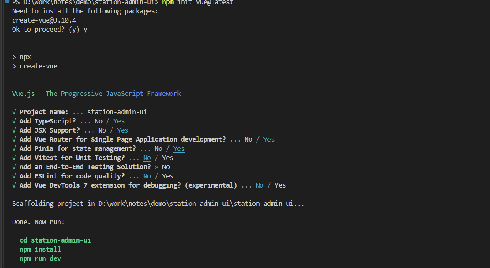
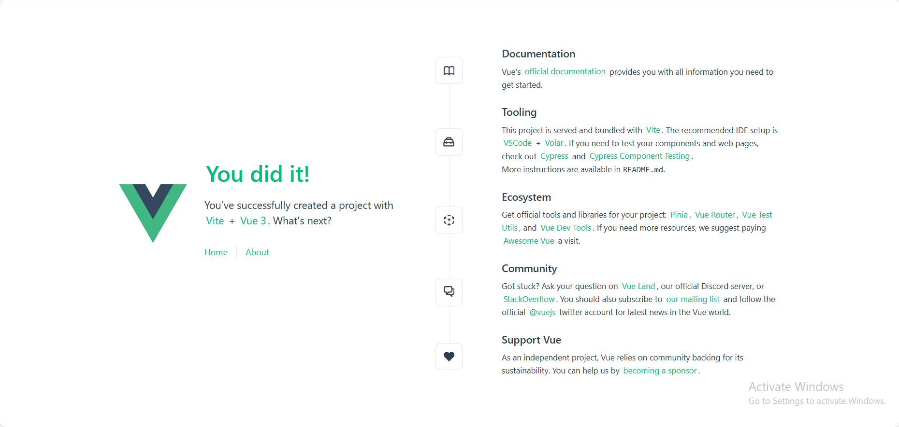

# vite、vue3、TS项目搭建

### 一、 使用vite创建vue3项目

**npm init vue@latest** 或者**npm create vite@latest**进行初始化项目并创建项目名称station-admin-ui，进入code目录进行基本部署。

**cd station-admin-ui、npm install 、npm run dev**

```bash
npm init vue@latest
```

<figure><figcaption></figcaption></figure>

完成vue3项目搭建。

通过脚手架我们可以生成一个 `vite`+`vue3`+`ts`+`vue router`+`pinia`的项目

#### 项目文件说明

```markdown
my-vite-vue3-project
├── node_modules
├── public
│   └── vite.svg
├── src
│   ├── assets
│   │   └── vue.svg
│   ├── components
│   │   └── HelloWorld.vue
│   ├── stores
│   │   └── index.ts
│   ├── views
│   │   └── Home.vue
│   ├── App.vue
│   ├── main.ts
│   ├── router.ts
│   └── vite-env.d.ts
├── .gitignore
├── index.html
├── package.json
├── tsconfig.json
├── tsconfig.node.json
└── vite.config.ts
​
```

**详细文件说明**

* **node\_modules/**：存放项目依赖的 Node.js 模块。
* **public/**：存放公共资源文件。
  * `vite.svg`：示例图片文件。
* **src/**：存放源代码文件。
  *   assets/

      ：存放静态资源（如图片、字体等）。

      * `vue.svg`：示例图片文件。
  *   components/

      ：存放 Vue 组件。

      * `HelloWorld.vue`：示例组件文件。
  *   stores/

      ：存放 Pinia 状态管理文件。

      * `index.ts`：Pinia 状态管理示例文件。
  *   views/

      ：存放视图组件。

      * `Home.vue`：主页组件。
  * `App.vue`：根组件。
  * `main.ts`：项目的入口文件，负责初始化 Vue 实例并挂载到 DOM。
  * `router.ts`：Vue Router 配置文件。
  * `vite-env.d.ts`：Vite 环境声明文件。
* **.gitignore**：Git 忽略文件，用于指定哪些文件或目录不应该被 Git 追踪。
* **index.html**：项目的 HTML 模板文件，Vite 会自动将打包后的文件注入到这个模板中。
* **package.json**：项目配置文件，记录了项目的依赖、脚本等信息。
* **tsconfig.json**：TypeScript 配置文件。
* **tsconfig.node.json**：针对 Node.js 的 TypeScript 配置文件。
* **vite.config.ts**：Vite 配置文件，用于配置 Vite 的行为。

#### 启动项目

运行

```bash
npm install
npm run dev
```

我们即可启动项目

<figure><figcaption></figcaption></figure>

### 二、 配置vue-router

如果已经通过脚手架安装我们可以**跳过**

如果我们时单独引入我们先安装, **npm install vue-router@next --save**

* 分离式：在src目录下创建router文件夹，并在文件夹下创建index.js和routes.js

**index.ts ：(只用来存放router的配置信息)**

```typescript
import { createRouter, createWebHistory } from 'vue-router'
import routes from './routes'
​
const router = createRouter({
  history: createWebHistory(import.meta.env.BASE_URL),
  routes: routes
})
​
export default router
​
```

**routes.ts： (用来存放路由信息)**

```typescript
const routes=[
    {
       path: "/",
       redirect: "/home",
     },
     {
       path: "/home",
       name: "home",
       component: () => import('@/views/HomeView.vue'),
     },
     {
         name:'about',
         path:'/about',
         component:()=>import('@/views/AboutView.vue'),
             meta:{
                 title:"页面"
             },
       },
   ]
   
   export default routes 
```

* 修改main.ts

```typescript
import { createApp } from 'vue';
import App from './App.vue';
import router from './router';
 
const app = createApp(App);
app.use(router);
app.mount('#app');
```

* 修改App.vue

```
<template>
    <router-view /> 
</template>
```

**调用方式**：

```
<template>
  <div>
    <router-link to="/">Home</router-link>
    <button @click="gotoAbout"> 关于 </button>
  </div>
<script setup>
 import{useRouter} from 'vue-router'
    const router = useRouter();
    const gotoAbout = () => {
        router.push({
             path: '/about',
             query: { id: 123 }
        })
    }
</script>
```

### 三、封装axios

```bash
npm install axios
```

安装element-plus 这里可以按需安装，我这里使用element-plus作为ui组件所以

```bash
npm install element-plus --save
```

在`src`目录下创建`request`文件夹，在`request`文件夹下创建`api`文件夹以及`index.ts`

`api`文件夹中存放交互代码，`index.ts`中存放`axios`配置代码

**`index.ts`**

```typescript
import axios from "axios";
//为拦截器报错所用的弹框，如不需要可以不导入
import { ElMessage } from "element-plus";
​
const service=axios.create({
    baseURL: import.meta.env.BASE_URL, //基本路径，后面可直接写/方法即可
    withCredentials: false, // 异步请求携带cookie
    // 设置请求头
    headers: {
        // 设置后端需要的传参类型
        // 'Content-Type': 'application/json;charset=UTF-8',
        // 'token': 'your token',
        // 'X-Requested-With': 'XMLHttpRequest',  
         "Access-Control-Allow-Origin": "*",
    },
      //设置请求超时时间
    timeout: 1000*60*5,
})
​
//*可选
//请求拦截器
service.interceptors.request.use((request)=>{
    //配置请求头
    // request.headers.common['Authorization']=window.sessionStorage.getItem('token')===null? null : window.sessionStorage.getItem('token')
   //一定要把处理过的request返回
    return request;
 },
 err=>Promise.reject(err)
 )
 //响应拦截器
 service.interceptors.response.use((response)=>{
    //获取接口返回结果
    const res=response.data
    if(res.code==200){
        return res;
    }else{
        ElMessage.error(res.data||'网络异常')
        return res;
    }
    },
    (err)=>Promise.reject(err)
 )
 export default service;
```

**api.ts:**

```typescript
import request from "@/request/index"
/**
 * @description 用户登录
 */
 export function login(data:any){
    return request({
        method:"post",
        url:"/user/login",
        data:data,
    })
}
/**
 * @description 获取用户信息
 */
export function getUserInfo(data:string){
    return request({
        headers: {
            'Content-Type': 'application/x-www-form-urlencoded; charset=UTF-8' 
          },
        method:"post",
        url:"/user/getUserInfo",
        data:{
            'userId':data
        },
    })
}
```

**调用方式(例举)：**

```typescript
      //处理登录逻辑
     async function handleLogin(){
        try {
            const res=await login(form.value).then(res=>{
               console.log(res.data)
            })   
        } catch (error) {
            console.log(error);
        }
      }
```

### 四、Pinia集成

如果已经通过脚手架安装我们可以**跳过** 安装

```bash
npm install pinia
```

* 修改main.ts,在main.ts中添加代码：

**main.ts**

```typescript
import { createPinia } from 'pinia'
app.use(createPinia())
```

* store目录下新建使用的store，此处使用store.js

注：defineStore 是需要传参的，第一个参数是标识id，第二个参数是一个对象，有三个模块， state，getters，actions。

```typescript
import { ref, computed } from "vue";
import { defineStore } from "pinia";
// 选项式api写法
// export const store1 = defineStore("storeNum",{
//      state: () => {
//       return { 
//              num: 0,
//              name: "coder"}
//      },
//     actions: {
//       add() {
//         this.num++;
//       },
//     },
//   }
// );
// 组合式api写法
//ref() 就是 state 属性
//computed() 就是 getters
//function() 就是 actions
export const store2 = defineStore("storeNum",() => {
    const num = ref(0);
    const name=ref("coder")
    const add =()=> {
      num.value++;
    }
    return {
      num,
      name,
      add
    };
  },
);
```

* 组件中使用Pinia

```typescript
<script setup>
import { store2 } from '@/stores/store'
import { storeToRefs } from 'pinia'
const storeNum = store2()
let {name,num}=storeToRefs(storeNum); //解构,修改必须引用storeToRefs进行解构处理
const clickHanlde=()=>{
    storeNum.add();}
const batchHanlde = ()=>{
    //store批量处理
    storeNum.$patch(state=>{
        state.num++;
        state.name = 'newCoder';
    })
}
</script>
<template>
    <div>Num{{ storeNum.Num }}</div>
    <button @click="clickHanlde">Num++</button>
    <button @click='batchHanlde'>批量处理</button>
</template>
```

**数据持久化存储，即刷新页面后也能存储数据**

```
npm i pinia-plugin-persistedstate
```

* 在store目录下新建一个配置文件index.js，或者直接在main.js中添加

> 注：个人觉得分离后代码更清晰（主观）

```typescript
import { createPinia } from "pinia";
import {createPersistedState } from 'pinia-plugin-persistedstate'
const pinia = createPinia()
pinia.use(createPersistedState({
    serializer:{   // 指定参数序列化器
        serialize: JSON.stringify,
        deserialize: JSON.parse
    }
}))
export default pinia
```

* 加入持久化存储后`store.ts`的写法

```typescript
import { ref, computed } from "vue";
import { defineStore } from "pinia";
// 选项式写法
// export const store = defineStore("storeId",{
//     state: () => ({ num: 0 }),
//     actions: {
//       add() {
//         this.num++;
//       }
//     },
//     启用持久化存储(全局持久化)
//     persist: { enabled: true,  // 配置key和持久化存储的方式
//                strategies: [{
//                   key: 'numStore',
//                   storage: window.localStorage,  //默认localStorage,/sessionStorage
//                   }]
//                } 
// );
​
// 组合式写法 
export const store = defineStore("storeId",() => {
    const num = ref(0);
    const name=ref("coder");
    const age=ref(18);
    const add =()=> {
      num.value++;
    }
    return {
      num,
      add
    };
  },
  {
//  选项式写法演示的是全局持久化，组合式写法演示的是指定字段持久化，不配置默认全部持久化
//  persist: true, 
    persist: {  enabled: true,
              strategies: [{
                            storage: window.localStorage,
                            paths: ['name', 'num'] // paths配置需要持久化的字段
                            beforeRestore: context => {
                                    console.log('Before', context)
                             },
                            afterRestore: context => {
                                    console.log('After', context)
                            }
                           }]
              }
  },                                
);
```

### 五、vite设置代理解决跨域问题

`vite.config.ts`中配置，代理前端端口到后端8080端口

```typescript
import{defineConfig} from 'vite'
import vue from '@vitejs/plugin-vue'
​
export default defineConfig({
    plugins: [
        vue(),
    ]，
    server:{
        proxy:{
         //可直接写:'/api ': 'http://localhost:8080/'
          '/api':{
              target: 'http://127.0.0.1:8080', //目标url
                 changeOrigin: true, //支持跨域
              ws: true, //允许websocket代理
              rewrite: (path) => path.replace(/^\/api/, ""), //重写路径,替换/api
         }
       }
    }
})
```

### 六、vite配置@

> 配置时.vue文件需要加.vue后缀，不能省略，js可省略，适用vue3.1以上版本

**vite.config.ts中配置**：

```typescript
import { defineConfig } from 'vite'
import vue from '@vitejs/plugin-vue'
import {resolve} from 'path'
​
// https://vitejs.dev/config/
export default defineConfig({
  plugins: [vue()],
  resolve: {
    //配置路径别名
    alias: {
      '@' : resolve(__dirname,'./src'),
    }
  }
})
```

### 七、Vite配置setup语法糖插件：解决import{ref,reactive...}引入问题

在 Vue 3 项目中，可以使用 `<script setup>` 语法糖来简化组件的定义。要解决在 `<script setup>` 中频繁引入 `ref`、`reactive` 等 API 的问题，可以使用 Vite 插件 `unplugin-auto-import` 自动导入这些 API。以下是配置步骤：

#### 1. 安装 `unplugin-auto-import`

首先，安装 `unplugin-auto-import`：

```bash
npm install unplugin-auto-import -D
```

#### 2. 配置 Vite 插件

在 `vite.config.ts` 文件中配置 `unplugin-auto-import` 插件：

```typescript
// vite.config.ts
import { defineConfig } from 'vite';
import vue from '@vitejs/plugin-vue';
import path from 'path';
import AutoImport from 'unplugin-auto-import/vite';
​
export default defineConfig({
  plugins: [
    vue(),
    AutoImport({
      imports: ['vue'], // 自动导入 Vue API
      dts: 'src/auto-imports.d.ts' // 生成类型定义文件
    })
  ],
  resolve: {
    alias: {
      '@': path.resolve(__dirname, 'src')
    }
  }
});
```

#### 3. 使用 `<script setup>`

现在，你可以在组件中使用 `<script setup>` 语法糖，并且不需要手动引入常用的 Vue API。例如：

```typescript
<!-- src/components/Counter.vue -->
<template>
  <div>
    <h1>Counter: {{ count }}</h1>
    <button @click="increment">Increment</button>
    <button @click="decrement">Decrement</button>
    <p>Double Count: {{ doubleCount }}</p>
  </div>
</template>
​
<script setup lang="ts">
const count = ref(0);
​
const increment = () => {
  count.value++;
};
​
const decrement = () => {
  count.value--;
};
​
const doubleCount = computed(() => count.value * 2);
</script>
​
<style scoped>
button {
  margin-right: 10px;
}
</style>
```

#### 4. 生成的类型定义文件

插件会在 `src` 目录下生成 `auto-imports.d.ts` 文件，确保你的编辑器能够识别自动导入的 API。如果你使用 TypeScript，请确保该文件在 `tsconfig.json` 的 `include` 配置中：

```tsconfig
// tsconfig.json
{
  "compilerOptions": {
    "baseUrl": ".",
    "paths": {
      "@/*": ["src/*"]
    }
  },
  "include": ["src/**/*", "src/auto-imports.d.ts"],
  "exclude": ["node_modules", "dist"]
}
```

通过以上步骤，你可以在 Vue 3 项目中使用 `<script setup>` 语法糖，并自动导入 `ref`、`reactive` 等常用的 Vue API，简化组件的编写过程。

参考： https://www.cnblogs.com/ProsperousEnding/p/17570132.html
